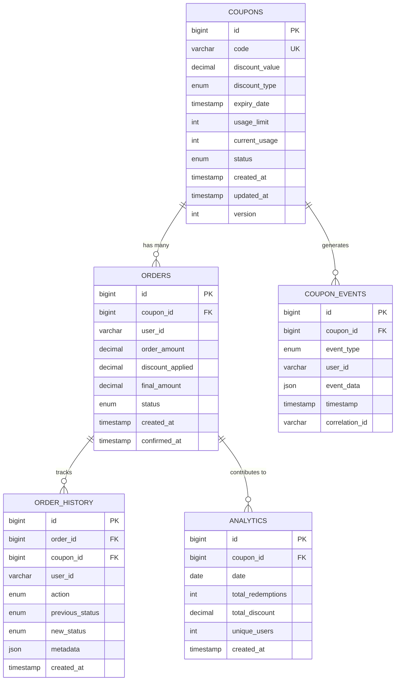

# 🎫 Coupon Management System

> **A comprehensive high-level design for a production-ready coupon management microservice**

---

## 🏗️ High-Level Architecture

### **System Architecture Overview**

```
┌─────────────────────────────────────────────────────────────────────────────────────────────────────────┐
│                                           CLIENT LAYER                                                  │
├─────────────────────────────────────────────────────────────────────────────────────────────────────────┤
│  📱 Mobile App  │  🌐 Web App  │  🖥️ Desktop App  │  🤖 Third-party API  │  📊 Analytics Dashboard  │
└─────────────────────────────────────────────────────────────────────────────────────────────────────────┘
                                                    │
                                                    ▼
┌─────────────────────────────────────────────────────────────────────────────────────────────────────────┐
│                                        API GATEWAY LAYER                                                │
├─────────────────────────────────────────────────────────────────────────────────────────────────────────┤
│  🔐 Authentication  │  🚦 Rate Limiting  │  📝 Request Logging  │  🔄 Request Routing  │  🛡️ Security  │
└─────────────────────────────────────────────────────────────────────────────────────────────────────────┘
                                                    │
                                                    ▼
┌─────────────────────────────────────────────────────────────────────────────────────────────────────────┐
│                                      LOAD BALANCER LAYER                                               │
├─────────────────────────────────────────────────────────────────────────────────────────────────────────┤
│  ⚖️ Traffic Distribution  │  🔍 Health Checks  │  🔄 Failover  │  📊 Load Monitoring  │  🚀 SSL Termination  │
└─────────────────────────────────────────────────────────────────────────────────────────────────────────┘
                                                    │
                                                    ▼
┌─────────────────────────────────────────────────────────────────────────────────────────────────────────┐
│                                     MICROSERVICES LAYER                                                │
├─────────────────────────────────────────────────────────────────────────────────────────────────────────┤
│  🎫 Coupon Service  │  👤 User Service  │  💳 Payment Service  │  📊 Analytics Service  │  🔔 Notification Service  │
│  ┌──────────────┐   │  ┌──────────────┐  │  ┌──────────────┐   │  ┌──────────────┐      │  ┌──────────────┐        │
│  │ Generation   │   │  │ Auth         │  │  │ Processing   │   │  │ Reporting    │      │  │ Email/SMS    │        │
│  │ Validation   │   │  │ Profile      │  │  │ Refunds      │   │  │ Dashboards   │      │  │ Push         │        │
│  │ Redemption   │   │  │ Preferences  │  │  │ Settlement   │   │  │ Metrics      │      │  │ Webhooks     │        │
│  │ Analytics    │   │  │ History      │  │  │ Fraud Check  │   │  │ Alerts       │      │  │ Templates    │        │
│  └──────────────┘   │  └──────────────┘  │  └──────────────┘   │  └──────────────┘      │  └──────────────┘        │
└─────────────────────────────────────────────────────────────────────────────────────────────────────────┘
                                                    │
                                                    ▼
┌─────────────────────────────────────────────────────────────────────────────────────────────────────────┐
│                                    SERVICE DISCOVERY & CONFIGURATION                                   │
├─────────────────────────────────────────────────────────────────────────────────────────────────────────┤
│  🔍 Service Registry  │  ⚙️ Configuration Management  │  🔄 Service Discovery  │  📋 Health Monitoring  │
└─────────────────────────────────────────────────────────────────────────────────────────────────────────┘
                                                    │
                                                    ▼
┌─────────────────────────────────────────────────────────────────────────────────────────────────────────┐
│                                      DATA LAYER                                                       │
├─────────────────────────────────────────────────────────────────────────────────────────────────────────┤
│  🗄️ Primary Database  │  🗄️ Read Replicas  │  🗄️ Analytics DB  │  🗄️ Audit Database  │  🗄️ Backup Storage  │
│  ┌──────────────┐     │  ┌──────────────┐  │  ┌──────────────┐  │  ┌──────────────┐    │  ┌──────────────┐      │
│  │ PostgreSQL   │     │  │ PostgreSQL   │  │  │ ClickHouse   │  │  │ PostgreSQL   │    │  │ S3 Glacier   │      │
│  │ (Master)     │     │  │ (Replicas)   │  │  │ (Analytics)  │  │  │ (Audit Logs) │    │  │ (Backups)    │      │
│  └──────────────┘     │  └──────────────┘  │  └──────────────┘  │  └──────────────┘    │  └──────────────┘      │
└─────────────────────────────────────────────────────────────────────────────────────────────────────────┘
                                                    │
                                                    ▼
┌─────────────────────────────────────────────────────────────────────────────────────────────────────────┐
│                                      CACHE LAYER                                                      │
├─────────────────────────────────────────────────────────────────────────────────────────────────────────┤
│  🚀 Application Cache  │  🚀 Distributed Cache  │  🚀 CDN Cache  │  🚀 Session Store  │  🚀 Rate Limit Cache  │
│  ┌──────────────┐     │  ┌──────────────┐      │  ┌──────────────┐  │  ┌──────────────┐  │  ┌──────────────┐      │
│  │ Caffeine     │     │  │ Redis Cluster │      │  │ CloudFront   │  │  │ Redis        │  │  │ Redis        │      │
│  │ (Local)      │     │  │ (Shared)      │      │  │ (Static)     │  │  │ (Sessions)   │  │  │ (Rate Lim)   │      │
│  └──────────────┘     │  └──────────────┘      │  └──────────────┘  │  └──────────────┘  │  └──────────────┘      │
└─────────────────────────────────────────────────────────────────────────────────────────────────────────┘
                                                    │
                                                    ▼
┌─────────────────────────────────────────────────────────────────────────────────────────────────────────┐
│                                    MESSAGE QUEUE LAYER                                                │
├─────────────────────────────────────────────────────────────────────────────────────────────────────────┤
│  📨 Event Streaming  │  📨 Message Queue  │  📨 Dead Letter Queue  │  📨 Event Store  │  📨 Stream Processing  │
│  ┌──────────────┐    │  ┌──────────────┐  │  ┌──────────────┐      │  ┌──────────────┐  │  ┌──────────────┐      │
│  │ Apache Kafka │    │  │ RabbitMQ     │  │  │ Dead Letter   │      │  │ Event Store  │  │  │ Kafka Streams │      │
│  │ (Events)     │    │  │ (Messages)   │  │  │ Queue         │      │  │ (Audit)      │  │  │ (Analytics)  │      │
│  └──────────────┘    │  └──────────────┘  │  └──────────────┘      │  └──────────────┘  │  └──────────────┘      │
└─────────────────────────────────────────────────────────────────────────────────────────────────────────┘
                                                    │
                                                    ▼
┌─────────────────────────────────────────────────────────────────────────────────────────────────────────┐
│                                   MONITORING & OBSERVABILITY                                          │
├─────────────────────────────────────────────────────────────────────────────────────────────────────────┤
│  📊 Metrics Collection  │  🔍 Distributed Tracing  │  📝 Centralized Logging  │  🚨 Alerting  │  📈 Dashboards  │
│  ┌──────────────┐      │  ┌──────────────┐         │  ┌──────────────┐        │  ┌──────────────┐  │  ┌──────────────┐  │
│  │ Prometheus   │      │  │ Jaeger       │         │  │ ELK Stack     │        │  │ AlertManager │  │  │ Grafana       │  │
│  │ (Metrics)    │      │  │ (Tracing)    │         │  │ (Logs)        │        │  │ (Alerts)     │  │  │ (Dashboards)  │  │
│  └──────────────┘      │  └──────────────┘         │  └──────────────┘        │  └──────────────┘  │  └──────────────┘  │
└─────────────────────────────────────────────────────────────────────────────────────────────────────────┘
```

### **🏗️ Architecture Components**

#### **📱 Client Layer**
- **Mobile Apps**: iOS/Android applications for coupon management
- **Web Applications**: React/Angular frontend for admin and user interfaces
- **Third-party APIs**: Integration with external systems and partners
- **Analytics Dashboard**: Real-time monitoring and reporting interface

#### **🔐 API Gateway Layer**
- **Authentication**: JWT token validation and OAuth 2.0 integration
- **Rate Limiting**: Request throttling and abuse prevention
- **Request Logging**: Comprehensive request/response logging
- **Request Routing**: Intelligent routing to appropriate microservices
- **Security**: CORS, CSP, and other security headers

#### **⚖️ Load Balancer Layer**
- **Traffic Distribution**: Round-robin, least connections, IP hash
- **Health Checks**: Active monitoring of service health
- **Failover**: Automatic failover to healthy instances
- **SSL Termination**: HTTPS termination and certificate management
- **Load Monitoring**: Real-time traffic analysis

#### **🎫 Microservices Layer**
- **Coupon Service**: Core coupon management functionality
- **User Service**: User authentication and profile management
- **Payment Service**: Payment processing and refunds
- **Analytics Service**: Business intelligence and reporting
- **Notification Service**: Email, SMS, and push notifications

#### **🔍 Service Discovery & Configuration**
- **Service Registry**: Dynamic service registration and discovery
- **Configuration Management**: Centralized configuration management
- **Health Monitoring**: Service health checks and status monitoring
- **Load Balancing**: Client-side load balancing

#### **🗄️ Data Layer**
- **Primary Database**: PostgreSQL master for write operations
- **Read Replicas**: PostgreSQL replicas for read operations
- **Analytics Database**: ClickHouse for analytical queries
- **Audit Database**: Dedicated database for audit logs
- **Backup Storage**: S3 Glacier for long-term backups

#### **🚀 Cache Layer**
- **Application Cache**: Caffeine for local caching
- **Distributed Cache**: Redis Cluster for shared caching
- **CDN Cache**: CloudFront for static content delivery
- **Session Store**: Redis for session management
- **Rate Limit Cache**: Redis for rate limiting counters

#### **📨 Message Queue Layer**
- **Event Streaming**: Apache Kafka for event-driven architecture
- **Message Queue**: RabbitMQ for reliable message delivery
- **Dead Letter Queue**: Failed message handling
- **Event Store**: Persistent event storage for audit trails
- **Stream Processing**: Kafka Streams for real-time analytics

#### **📊 Monitoring & Observability**
- **Metrics Collection**: Prometheus for application metrics
- **Distributed Tracing**: Jaeger for request tracing
- **Centralized Logging**: ELK Stack for log aggregation
- **Alerting**: AlertManager for proactive monitoring
- **Dashboards**: Grafana for visualization and reporting

### **🔄 Data Flow**

```
1. Client Request → API Gateway
2. API Gateway → Load Balancer
3. Load Balancer → Microservice Instance
4. Microservice → Cache (if available)
5. Microservice → Database (if needed)
6. Microservice → Message Queue (for events)
7. Message Queue → Other Services (async processing)
8. Response → Client (through reverse path)
```

### **🛡️ Security Architecture**

```
┌─────────────────────────────────────────────────────────────────────────────────────────────────────────┐
│                                        SECURITY LAYERS                                                │
├─────────────────────────────────────────────────────────────────────────────────────────────────────────┤
│  🔐 Authentication  │  🔑 Authorization  │  🛡️ Data Encryption  │  🚦 Rate Limiting  │  🔍 Fraud Detection  │
│  ┌──────────────┐   │  ┌──────────────┐  │  ┌──────────────┐     │  ┌──────────────┐  │  ┌──────────────┐      │
│  │ OAuth 2.0    │   │  │ RBAC         │  │  │ TLS 1.3      │     │  │ Bucket4j     │  │  │ ML Models    │      │
│  │ JWT Tokens   │   │  │ ABAC         │  │  │ AES-256      │     │  │ Redis        │  │  │ Rules Engine │      │
│  │ MFA          │   │  │ API Keys     │  │  │ KMS          │     │  │ Gateway      │  │  │ Anomaly Det. │      │
│  └──────────────┘   │  └──────────────┘  │  └──────────────┘     │  └──────────────┘  │  └──────────────┘      │
└─────────────────────────────────────────────────────────────────────────────────────────────────────────┘
```

---

## �� Table of Contents
- [Overview](#overview)
- [Requirements](#requirements)
- [API Reference](#api-reference)
- [Database Schema](#database-schema)
- [Production Challenges & Solutions](#production-challenges-and-solutions)
- [Implementation Checklist](#implementation-checklist)
- [Technology Stack](#technology-stack)

---

## 🎯 Overview

This document provides a complete high-level design for a coupon redeeming microservice along with its Logical Level Design (LLD). The system is designed to handle high-concurrency scenarios, ensure data consistency, and provide scalability for production environments.

> 💡 **Key Features:**
> - 🔒 **Concurrency Control**: Handles multiple simultaneous redemption requests
> - 📈 **Scalability**: Designed for high-traffic events like Black Friday
> - 🛡️ **Security**: Fraud detection and rate limiting
> - 📊 **Monitoring**: Comprehensive observability and analytics
> - 🔄 **Reliability**: Disaster recovery and fault tolerance

## 📋 Requirements

The system should provide comprehensive functionalities for creating, validating, and redeeming coupons in a production environment.

### 🎯 Core Functionalities

| Functionality | Description | Use Case |
|---------------|-------------|----------|
| **🎫 Generate Coupon** | Creates new coupons with unique codes and configurable attributes | Bulk coupon generation for marketing campaigns |
| **✅ Validate Coupon** | Checks coupon validity (expiry, usage limits, status) | Pre-purchase validation to ensure coupon usability |
| **💳 Redeem Coupon** | Processes coupon redemption with atomic operations | Actual coupon usage during checkout |
| **📊 Analytics** | Tracks redemption patterns and performance metrics | Business intelligence and fraud detection |

### 🔧 Technical Requirements

- **High Availability**: 99.9% uptime
- **Low Latency**: < 100ms response time for validation
- **Scalability**: Handle 10,000+ concurrent users
- **Data Consistency**: Prevent over-redemption and race conditions
- **Security**: Protect against fraud and abuse 


## 🔌 API Reference

RESTful endpoints for interacting with the coupon system. All endpoints return JSON responses and require proper authentication.

### 📡 Endpoints Overview

| Method | Endpoint | Description | Authentication |
|--------|----------|-------------|----------------|
| **POST** | `/api/coupons/generate` | 🎫 Generate new coupons | Required |
| **GET** | `/api/coupons/{couponId}/validate` | ✅ Validate coupon status | Required |
| **POST** | `/api/coupons/{couponId}/redeem` | 💳 Redeem coupon | Required |
| **GET** | `/api/coupons/{couponId}/redemptionHistory` | 📊 Get redemption history | Required |

### 🔧 Path Parameters

| Parameter | Type | Description | Example |
|-----------|------|-------------|---------|
| `couponId` | `string` | **Required**. Unique coupon identifier | `SAVE50_2024` |

### 📝 Request/Response Examples

#### Generate Coupon
```http
POST /api/coupons/generate
Content-Type: application/json
Authorization: Bearer <token>

{
  "discountType": "PERCENTAGE",
  "discountValue": 20,
  "usageLimit": 1000,
  "expiryDate": "2024-12-31T23:59:59Z",
  "description": "20% off on all items"
}
```

#### Validate Coupon
```http
GET /api/coupons/SAVE50_2024/validate
Authorization: Bearer <token>

Response:
{
  "valid": true,
  "discount": 20,
  "discountType": "PERCENTAGE",
  "remainingUses": 45,
  "expiresAt": "2024-12-31T23:59:59Z"
}
```

#### Redeem Coupon
```http
POST /api/coupons/SAVE50_2024/redeem
Content-Type: application/json
Authorization: Bearer <token>

{
  "userId": "user123",
  "orderId": "order456",
  "amount": 100.00
}

Response:
{
  "success": true,
  "discountApplied": 20.00,
  "finalAmount": 80.00,
  "redemptionId": "red_789"
}
```


## 🗄️ Database Schema

The database design follows a normalized structure to ensure data integrity, performance, and scalability. The schema includes audit trails and supports high-concurrency operations.


### 🎫 Coupons Table (Master Data)

| Column | Type | Constraints | Description |
|--------|------|-------------|-------------|
| `id` | `BIGINT` | **Primary Key, Auto-increment** | Unique identifier for the coupon |
| `code` | `VARCHAR(50)` | **Unique, Not Null** | Alphanumeric coupon code (e.g., "SAVE50_2024") |
| `discount_value` | `DECIMAL(10,2)` | **Not Null** | Discount amount or percentage |
| `discount_type` | `ENUM` | **Not Null** | `PERCENTAGE` or `FIXED_AMOUNT` |
| `expiry_date` | `TIMESTAMP` | **Not Null** | When the coupon expires |
| `usage_limit` | `INT` | **Not Null, Default: 1** | Maximum redemption count |
| `current_usage` | `INT` | **Not Null, Default: 0** | Current number of redemptions |
| `status` | `ENUM` | **Not Null, Default: 'ACTIVE'** | `ACTIVE`, `INACTIVE`, `EXPIRED` |
| `created_at` | `TIMESTAMP` | **Not Null, Default: NOW()** | Creation timestamp |
| `updated_at` | `TIMESTAMP` | **Not Null, Default: NOW()** | Last update timestamp |
| `version` | `INT` | **Not Null, Default: 1** | Optimistic locking version |

**Indexes:**
```sql
CREATE INDEX idx_coupons_code ON coupons(code);
CREATE INDEX idx_coupons_status_expiry ON coupons(status, expiry_date);
CREATE INDEX idx_coupons_usage ON coupons(current_usage, usage_limit);
```

### 💳 Orders Table (Transactions)

| Column | Type | Constraints | Description |
|--------|------|-------------|-------------|
| `id` | `BIGINT` | **Primary Key, Auto-increment** | Unique order identifier |
| `coupon_id` | `BIGINT` | **Foreign Key** | Reference to coupons table |
| `user_id` | `VARCHAR(50)` | **Not Null** | User who redeemed the coupon |
| `order_amount` | `DECIMAL(10,2)` | **Not Null** | Original order amount |
| `discount_applied` | `DECIMAL(10,2)` | **Not Null** | Discount amount applied |
| `final_amount` | `DECIMAL(10,2)` | **Not Null** | Final amount after discount |
| `status` | `ENUM` | **Not Null, Default: 'PENDING'** | `PENDING`, `CONFIRMED`, `CANCELLED` |
| `created_at` | `TIMESTAMP` | **Not Null, Default: NOW()** | Order creation time |
| `confirmed_at` | `TIMESTAMP` | **Null** | When order was confirmed |

**Indexes:**
```sql
CREATE INDEX idx_orders_coupon_user ON orders(coupon_id, user_id);
CREATE INDEX idx_orders_status ON orders(status);
CREATE INDEX idx_orders_created ON orders(created_at);
```

### 📜 Order History Table (Audit Trail)

| Column | Type | Constraints | Description |
|--------|------|-------------|-------------|
| `id` | `BIGINT` | **Primary Key, Auto-increment** | Unique history record |
| `order_id` | `BIGINT` | **Foreign Key** | Reference to orders table |
| `coupon_id` | `BIGINT` | **Foreign Key** | Reference to coupons table |
| `user_id` | `VARCHAR(50)` | **Not Null** | User who performed the action |
| `action` | `ENUM` | **Not Null** | `REDEEMED`, `CANCELLED`, `EXPIRED` |
| `previous_status` | `ENUM` | **Null** | Status before the action |
| `new_status` | `ENUM` | **Not Null** | Status after the action |
| `metadata` | `JSON` | **Null** | Additional context data |
| `created_at` | `TIMESTAMP` | **Not Null, Default: NOW()** | When the action occurred |

### 🔄 Coupon Events Table (Event Store)

| Column | Type | Constraints | Description |
|--------|------|-------------|-------------|
| `id` | `BIGINT` | **Primary Key, Auto-increment** | Unique event identifier |
| `coupon_id` | `BIGINT` | **Foreign Key** | Reference to coupons table |
| `event_type` | `ENUM` | **Not Null** | `CREATED`, `VALIDATED`, `REDEEMED`, `EXPIRED` |
| `user_id` | `VARCHAR(50)` | **Null** | User who triggered the event |
| `event_data` | `JSON` | **Not Null** | Complete event payload |
| `timestamp` | `TIMESTAMP` | **Not Null, Default: NOW()** | Event occurrence time |
| `correlation_id` | `VARCHAR(100)` | **Null** | For distributed tracing |

### 📊 Analytics Table (Reporting)

| Column | Type | Constraints | Description |
|--------|------|-------------|-------------|
| `id` | `BIGINT` | **Primary Key, Auto-increment** | Unique analytics record |
| `coupon_id` | `BIGINT` | **Foreign Key** | Reference to coupons table |
| `date` | `DATE` | **Not Null** | Analytics date |
| `total_redemptions` | `INT` | **Not Null, Default: 0** | Daily redemption count |
| `total_discount` | `DECIMAL(10,2)` | **Not Null, Default: 0** | Total discount applied |
| `unique_users` | `INT` | **Not Null, Default: 0** | Unique users who redeemed |
| `created_at` | `TIMESTAMP` | **Not Null, Default: NOW()** | Record creation time |

### 🔗 Relationships



## Production Challenges and Solutions

### 1. Concurrency and Race Conditions

#### Challenge: Multiple Users Redeeming Limited Coupons
**Problem**: When a coupon has only 1 usage left and multiple users try to redeem it simultaneously, both might succeed due to race conditions.

**Example Scenario**:
```
Coupon: "SAVE50" (Usage Limit: 1, Current Usage: 0)
User A and User B both attempt redemption at the same time
Result: Both users might get the coupon, exceeding the limit
```

**Why This Happens**: 
The race condition occurs because the check (is coupon available?) and the update (increment usage count) are not atomic operations. Between these two steps, another thread can read the same state and proceed with its own redemption, leading to over-redemption.

#### Solutions:

##### A. Database-Level Solutions

**1. Pessimistic Locking**
```sql
-- Using SELECT FOR UPDATE
BEGIN TRANSACTION;
SELECT * FROM coupons WHERE id = ? AND usage_count < usage_limit FOR UPDATE;
UPDATE coupons SET usage_count = usage_count + 1 WHERE id = ?;
COMMIT;
```

**Why This Works**:
- **Exclusive Lock**: `SELECT ... FOR UPDATE` places an exclusive lock on the selected rows, preventing other transactions from reading or modifying them until the current transaction completes.
- **Serialization**: This forces all redemption attempts to be processed sequentially, eliminating race conditions.
- **Database-Level Guarantee**: The database engine ensures that only one transaction can hold the lock at any time.
- **Automatic Rollback**: If the transaction fails, the database automatically releases the lock and rolls back changes.

**Trade-offs**:
- **Performance Impact**: Can cause blocking and reduced throughput under high concurrency
- **Deadlock Risk**: Multiple transactions waiting for locks can cause deadlocks
- **Best For**: High-value coupons where consistency is more important than performance

**2. Optimistic Locking**
```sql
-- Using version column
UPDATE coupons 
SET usage_count = usage_count + 1, version = version + 1 
WHERE id = ? AND version = ? AND usage_count < usage_limit;
```

**Why This Works**:
- **Version Control**: Each row has a version number that increments with every update
- **Conditional Update**: The UPDATE only succeeds if the version matches (no concurrent modifications occurred)
- **No Blocking**: Unlike pessimistic locking, this doesn't block other transactions
- **Conflict Detection**: If another transaction modified the row, the version mismatch causes the update to fail
- **Retry Logic**: Applications can retry the operation with the new version number

**Trade-offs**:
- **Retry Overhead**: Failed updates require application-level retry logic
- **Better Performance**: No blocking, allowing higher concurrency
- **Best For**: Moderate concurrency scenarios where performance is important

**3. Atomic Operations (Redis)**
```redis
-- Using Redis Lua script for atomicity
EVAL "
  local current = redis.call('GET', KEYS[1])
  if tonumber(current) < tonumber(ARGV[1]) then
    redis.call('INCR', KEYS[1])
    return 1
  end
  return 0
" 1 coupon:SAVE50:usage 1
```

**Why This Works**:
- **Single Atomic Operation**: The entire Lua script executes as one atomic operation
- **No Race Conditions**: Redis guarantees that no other commands can interrupt the script execution
- **High Performance**: Redis operations are extremely fast, making this suitable for high-traffic scenarios
- **Memory-Based**: No disk I/O, resulting in sub-millisecond response times
- **Built-in Consistency**: Redis ensures that the check and increment happen atomically

**Trade-offs**:
- **Memory Limitation**: Data is stored in memory, so it's not suitable for persistent storage
- **Persistence Trade-offs**: Redis can be configured for persistence but with performance implications
- **Best For**: High-frequency operations where speed is critical

##### B. Application-Level Solutions

**1. Distributed Locking**
```java
// Using Redisson
RLock lock = redisson.getLock("coupon:" + couponId);
try {
    if (lock.tryLock(5, 10, TimeUnit.SECONDS)) {
        // Process redemption
        processCouponRedemption(couponId, userId);
    }
} finally {
    lock.unlock();
}
```

**Why This Works**:
- **Distributed Coordination**: Uses Redis or ZooKeeper to coordinate locks across multiple application instances
- **Exclusive Access**: Only one application instance can hold the lock for a specific coupon at any time
- **Automatic Cleanup**: Redisson provides automatic lock release and renewal mechanisms
- **Fault Tolerance**: If the application crashes, the lock is automatically released after a timeout
- **Cross-Service Coordination**: Works even when multiple microservices need to coordinate

**How It Prevents Race Conditions**:
1. **Lock Acquisition**: Only one thread/process can acquire the lock for a specific coupon
2. **Exclusive Processing**: While holding the lock, the process can safely check and update the coupon state
3. **Atomic Release**: The lock is released only after the entire redemption process is complete
4. **Queue Formation**: Other requests wait for the lock to be released, ensuring sequential processing

**Trade-offs**:
- **Network Overhead**: Requires network calls to the lock service
- **Latency**: Adds some latency due to lock acquisition time
- **Best For**: Distributed systems with multiple application instances

**2. Queue-Based Processing**
```java
// Using RabbitMQ/Redis Queue
@RabbitListener(queues = "coupon-redemption")
public void processRedemption(CouponRedemptionRequest request) {
    // Sequential processing ensures no race conditions
    processCouponRedemption(request.getCouponId(), request.getUserId());
}
```

**Why This Works**:
- **Sequential Processing**: All redemption requests are processed one at a time in the order they were received
- **No Concurrent Access**: Only one consumer processes requests at a time, eliminating race conditions
- **Reliability**: Message queues provide guaranteed delivery and persistence
- **Scalability**: Can scale consumers while maintaining sequential processing per coupon
- **Decoupling**: Separates the request handling from the actual processing

**How It Prevents Race Conditions**:
1. **Request Queuing**: All redemption requests are placed in a queue
2. **Single Consumer**: One consumer processes requests sequentially
3. **No Parallel Processing**: By design, no two requests for the same coupon can be processed simultaneously
4. **Order Preservation**: Requests are processed in the order they were received

**Trade-offs**:
- **Latency**: Adds queue processing time to the response
- **Complexity**: Requires additional infrastructure (message broker)
- **Best For**: High-volume scenarios where eventual consistency is acceptable

**Tools**: Redisson, Apache ZooKeeper, etcd, RabbitMQ, Apache Kafka

### 2. 📈 Scalability Challenges

#### Challenge: High Traffic During Sales Events
**Problem**: During Black Friday, Cyber Monday, or flash sales, the system might receive thousands of redemption requests per second, causing performance degradation and potential service outages.

**Real-World Scenario**:
```
Black Friday 2024:
- 100,000 concurrent users
- 50,000 coupon validations per minute
- 10,000 coupon redemptions per minute
- Peak traffic: 5x normal load
```

#### Solutions:

##### A. 🚀 Horizontal Scaling

**Why This Works**:
- **Load Distribution**: Multiple application instances share the incoming traffic
- **Auto-Scaling**: Automatically adds/removes instances based on demand
- **Fault Tolerance**: If one instance fails, others continue serving requests
- **Geographic Distribution**: Can deploy across multiple regions for global users

```yaml
# Kubernetes deployment with auto-scaling
apiVersion: apps/v1
kind: Deployment
metadata:
  name: coupon-service
spec:
  replicas: 10
  selector:
    matchLabels:
      app: coupon-service
  template:
    metadata:
      labels:
        app: coupon-service
    spec:
      containers:
      - name: coupon-service
        image: coupon-service:latest
        resources:
          requests:
            memory: "512Mi"
            cpu: "250m"
          limits:
            memory: "1Gi"
            cpu: "500m"
---
apiVersion: autoscaling/v2
kind: HorizontalPodAutoscaler
metadata:
  name: coupon-service-hpa
spec:
  minReplicas: 5
  maxReplicas: 50
  targetCPUUtilizationPercentage: 70
  targetMemoryUtilizationPercentage: 80
```

**Scaling Triggers**:
- **CPU Usage**: Scale up when CPU > 70%
- **Memory Usage**: Scale up when memory > 80%
- **Custom Metrics**: Scale based on request queue length
- **Time-based**: Pre-scale before known traffic spikes

##### B. 🗄️ Multi-Level Caching Strategy

**Why This Works**:
- **Reduced Database Load**: Frequently accessed data served from cache
- **Faster Response Times**: Cache hits are 10-100x faster than database queries
- **Cost Reduction**: Fewer database connections and queries
- **Improved User Experience**: Sub-millisecond response times for cached data

```java
// L1 Cache: Application-level caching
@Cacheable(value = "coupon-cache", key = "#couponId")
public Coupon getCoupon(String couponId) {
    return couponRepository.findById(couponId);
}

// L2 Cache: Distributed Redis caching
@Cacheable(value = "coupon-validation", key = "#couponId")
public boolean validateCoupon(String couponId) {
    // Validation logic with business rules
    return performValidation(couponId);
}

// L3 Cache: CDN for static coupon data
@Cacheable(value = "coupon-static", key = "#couponId")
public CouponStaticData getCouponStaticData(String couponId) {
    // Static data like descriptions, terms
    return staticDataRepository.findByCouponId(couponId);
}
```

**Cache Invalidation Strategy**:
```java
// Invalidate cache when coupon is updated
@CacheEvict(value = {"coupon-cache", "coupon-validation"}, key = "#couponId")
public void updateCoupon(String couponId, CouponUpdateRequest request) {
    // Update logic
}

// TTL-based expiration
@Cacheable(value = "coupon-cache", key = "#couponId", ttl = "300") // 5 minutes
public Coupon getCoupon(String couponId) {
    return couponRepository.findById(couponId);
}
```

##### C. 🗂️ Database Sharding

**Why This Works**:
- **Horizontal Partitioning**: Data distributed across multiple database instances
- **Improved Performance**: Smaller datasets per database
- **Better Resource Utilization**: Each shard can be optimized independently
- **Fault Isolation**: Failure in one shard doesn't affect others

```sql
-- Shard by coupon ID hash (consistent hashing)
CREATE TABLE coupons_0 LIKE coupons;
CREATE TABLE coupons_1 LIKE coupons;
CREATE TABLE coupons_2 LIKE coupons;
CREATE TABLE coupons_3 LIKE coupons;

-- Routing logic
SELECT shard_number = HASH(coupon_id) % 4;
-- Route to appropriate shard based on hash
```

**Sharding Strategies**:
- **Hash-based**: Even distribution, good for random access
- **Range-based**: Good for time-series data (by creation date)
- **List-based**: Custom partitioning rules
- **Composite**: Combination of multiple strategies

**Tools**: Vitess, ShardingSphere, Custom sharding logic, AWS Aurora Global Database

### 3. 🔄 Data Consistency and Reliability

#### Challenge: Network Failures and Partial Updates
**Problem**: Network issues, service failures, or database timeouts during redemption can leave the system in an inconsistent state, where some operations succeed while others fail.

**Real-World Scenario**:
```
User attempts to redeem coupon "SAVE50":
1. ✅ Coupon validation succeeds
2. ✅ Coupon usage count increments
3. ❌ Order creation fails (payment service down)
4. ❌ User gets error, but coupon is already marked as used
Result: Inconsistent state - coupon used but no order created
```

#### Solutions:

##### A. 🎭 Saga Pattern (Distributed Transactions)

**Why This Works**:
- **Compensating Actions**: Each step has a corresponding rollback action
- **Eventual Consistency**: System eventually reaches a consistent state
- **Fault Tolerance**: Handles partial failures gracefully
- **Audit Trail**: Complete history of all operations and compensations

```java
// Saga orchestrator for distributed transactions
@Component
public class CouponRedemptionSaga {
    
    @Transactional
    public void redeemCoupon(String couponId, String userId) {
        String sagaId = UUID.randomUUID().toString();
        
        try {
            // Step 1: Reserve coupon (with timeout)
            boolean reserved = couponService.reserveCoupon(couponId, userId, sagaId);
            if (!reserved) {
                throw new CouponUnavailableException("Coupon not available");
            }
            
            // Step 2: Create order (with retry logic)
            Order order = orderService.createOrder(couponId, userId, sagaId);
            
            // Step 3: Confirm redemption
            couponService.confirmRedemption(couponId, userId, sagaId);
            
            // Step 4: Send confirmation notification
            notificationService.sendRedemptionConfirmation(userId, order);
            
        } catch (Exception e) {
            // Compensating actions in reverse order
            log.error("Saga failed for coupon: {}, user: {}", couponId, userId, e);
            
            // Step 4: Cancel notification (if sent)
            notificationService.cancelNotification(userId, sagaId);
            
            // Step 3: Revert redemption confirmation
            couponService.revertRedemption(couponId, userId, sagaId);
            
            // Step 2: Cancel order (if created)
            orderService.cancelOrder(couponId, userId, sagaId);
            
            // Step 1: Release coupon reservation
            couponService.releaseReservation(couponId, userId, sagaId);
            
            throw new RedemptionFailedException("Coupon redemption failed", e);
        }
    }
}
```

**Saga State Management**:
```java
@Entity
public class SagaState {
    private String sagaId;
    private String couponId;
    private String userId;
    private SagaStatus status; // STARTED, IN_PROGRESS, COMPLETED, FAILED
    private List<SagaStep> completedSteps;
    private List<SagaStep> pendingSteps;
    private LocalDateTime createdAt;
    private LocalDateTime updatedAt;
}
```

##### B. 📝 Event Sourcing (Audit Trail)

**Why This Works**:
- **Complete History**: Every state change is recorded as an event
- **Replay Capability**: Can reconstruct any point-in-time state
- **Audit Compliance**: Meets regulatory requirements for financial transactions
- **Debugging**: Easy to trace issues by replaying events

```java
// Event store for complete audit trail
@Entity
public class CouponEvent {
    private String eventId;
    private String couponId;
    private String userId;
    private String sagaId;
    private EventType eventType; // RESERVED, REDEEMED, EXPIRED, CANCELLED
    private String eventData; // JSON payload with complete state
    private LocalDateTime timestamp;
    private String correlationId; // For distributed tracing
    private String causationId; // Links related events
}

// Event types and their data structure
public enum EventType {
    COUPON_CREATED,
    COUPON_RESERVED,
    COUPON_REDEEMED,
    COUPON_EXPIRED,
    COUPON_CANCELLED,
    ORDER_CREATED,
    ORDER_CANCELLED
}
```

**Event Replay for State Reconstruction**:
```java
@Service
public class CouponStateReconstructor {
    
    public CouponState reconstructState(String couponId, LocalDateTime asOf) {
        List<CouponEvent> events = eventStore.getEvents(couponId, asOf);
        
        CouponState state = new CouponState();
        
        for (CouponEvent event : events) {
            switch (event.getEventType()) {
                case COUPON_CREATED:
                    state = applyCouponCreated(event, state);
                    break;
                case COUPON_RESERVED:
                    state = applyCouponReserved(event, state);
                    break;
                case COUPON_REDEEMED:
                    state = applyCouponRedeemed(event, state);
                    break;
                // ... other event types
            }
        }
        
        return state;
    }
}
```

##### C. 🔄 Outbox Pattern (Reliable Event Publishing)

**Why This Works**:
- **Guaranteed Delivery**: Events are stored in database before publishing
- **Exactly-Once Semantics**: Prevents duplicate event processing
- **Fault Tolerance**: Survives message broker failures
- **Consistency**: Database transaction includes event storage

```java
// Outbox table for reliable event publishing
@Entity
public class OutboxEvent {
    private String id;
    private String aggregateId; // couponId
    private String eventType;
    private String eventData; // JSON
    private EventStatus status; // PENDING, PUBLISHED, FAILED
    private LocalDateTime createdAt;
    private LocalDateTime publishedAt;
    private int retryCount;
}

// Outbox processor (runs as background job)
@Component
public class OutboxProcessor {
    
    @Scheduled(fixedRate = 1000) // Run every second
    public void processOutboxEvents() {
        List<OutboxEvent> pendingEvents = outboxRepository.findPendingEvents();
        
        for (OutboxEvent event : pendingEvents) {
            try {
                // Publish to message broker
                messageBroker.publish(event.getEventType(), event.getEventData());
                
                // Mark as published
                event.setStatus(EventStatus.PUBLISHED);
                event.setPublishedAt(LocalDateTime.now());
                outboxRepository.save(event);
                
            } catch (Exception e) {
                // Increment retry count
                event.setRetryCount(event.getRetryCount() + 1);
                
                if (event.getRetryCount() > MAX_RETRIES) {
                    event.setStatus(EventStatus.FAILED);
                }
                
                outboxRepository.save(event);
                log.error("Failed to publish event: {}", event.getId(), e);
            }
        }
    }
}
```

**Tools**: Apache Kafka, EventStore, Axon Framework, AWS EventBridge, RabbitMQ

### 4. 🛡️ Security Challenges

#### Challenge: Coupon Code Exploitation and Fraud
**Problem**: Users might try to guess coupon codes, exploit validation logic, or use automated bots to abuse the system, leading to financial losses and system abuse.

**Real-World Attack Scenarios**:
```
Attack Types:
1. 🎯 Brute Force: Automated guessing of coupon codes
2. 🤖 Bot Attacks: High-frequency requests from automated scripts
3. 🔄 Replay Attacks: Reusing expired or used coupons
4. 🌍 Geographic Abuse: Using VPNs to bypass location restrictions
5. 👥 Account Sharing: Multiple users sharing single-use coupons
```

#### Solutions:

##### A. 🚦 Multi-Level Rate Limiting

**Why This Works**:
- **Prevents Abuse**: Limits requests per user/IP to prevent brute force attacks
- **Protects Resources**: Prevents system overload from malicious traffic
- **Granular Control**: Different limits for different operations and user types
- **Real-time Adaptation**: Adjusts limits based on user behavior patterns

```java
// Using Bucket4j for sophisticated rate limiting
@RateLimiter(name = "coupon-validation", fallbackMethod = "validationFallback")
public boolean validateCoupon(String couponId, String userId) {
    // Validation logic with fraud checks
    return performValidationWithFraudDetection(couponId, userId);
}

@RateLimiter(name = "coupon-redemption", fallbackMethod = "redemptionFallback")
public boolean redeemCoupon(String couponId, String userId) {
    // Redemption logic with additional security
    return performRedemptionWithSecurityChecks(couponId, userId);
}

// Fallback methods for rate limit exceeded
public boolean validationFallback(String couponId, String userId) {
    log.warn("Rate limit exceeded for validation: user={}, coupon={}", userId, couponId);
    return false; // Return cached result or error
}

// Dynamic rate limiting based on user risk score
@RateLimiter(name = "dynamic-redemption")
public boolean redeemCouponWithDynamicLimit(String couponId, String userId) {
    UserRiskScore riskScore = fraudDetectionService.getUserRiskScore(userId);
    
    // Adjust rate limit based on risk
    if (riskScore.isHighRisk()) {
        // Stricter limits for high-risk users
        return processWithStrictLimits(couponId, userId);
    }
    
    return processWithNormalLimits(couponId, userId);
}
```

**Rate Limiting Configuration**:
```yaml
# Application configuration
rate-limits:
  validation:
    default: 100 # requests per minute
    premium: 500
    high-risk: 10
  redemption:
    default: 5 # redemptions per hour
    premium: 20
    high-risk: 1
  generation:
    admin: 1000 # coupons per day
    manager: 100
    user: 0 # users cannot generate coupons
```

##### B. 🔍 Advanced Input Validation and Sanitization

**Why This Works**:
- **Prevents Injection**: Blocks SQL injection, XSS, and other attacks
- **Data Integrity**: Ensures only valid data enters the system
- **Business Rule Enforcement**: Validates against business logic constraints
- **Audit Trail**: Logs all validation failures for security analysis

```java
// Comprehensive validation with business rules
@Valid
public class CouponRedemptionRequest {
    @Pattern(regexp = "^[A-Z0-9]{8,16}$", message = "Invalid coupon format")
    @NotBlank(message = "Coupon ID is required")
    private String couponId;
    
    @NotNull(message = "User ID is required")
    @Size(min = 1, max = 50, message = "User ID length invalid")
    @Pattern(regexp = "^[a-zA-Z0-9_-]+$", message = "Invalid user ID format")
    private String userId;
    
    @NotNull(message = "Order amount is required")
    @DecimalMin(value = "0.01", message = "Order amount must be positive")
    @DecimalMax(value = "999999.99", message = "Order amount too high")
    private BigDecimal orderAmount;
    
    @Valid
    @NotNull(message = "Device information is required")
    private DeviceInfo deviceInfo;
    
    @Valid
    @NotNull(message = "Location information is required")
    private LocationInfo locationInfo;
}

// Custom validation for business rules
@Component
public class CouponBusinessValidator {
    
    public ValidationResult validateRedemption(CouponRedemptionRequest request) {
        ValidationResult result = new ValidationResult();
        
        // Check if user has already used this coupon
        if (hasUserUsedCoupon(request.getUserId(), request.getCouponId())) {
            result.addError("User has already used this coupon");
        }
        
        // Check if user is in allowed geographic region
        if (!isLocationAllowed(request.getLocationInfo())) {
            result.addError("Coupon not available in this location");
        }
        
        // Check device fingerprint for suspicious activity
        if (isDeviceSuspicious(request.getDeviceInfo())) {
            result.addError("Suspicious device detected");
        }
        
        // Check time-based restrictions
        if (!isWithinValidTimeWindow(request.getCouponId())) {
            result.addError("Coupon not available at this time");
        }
        
        return result;
    }
}
```

##### C. 🤖 AI-Powered Fraud Detection

**Why This Works**:
- **Pattern Recognition**: Identifies suspicious behavior patterns
- **Real-time Analysis**: Provides instant risk assessment
- **Adaptive Learning**: Improves detection accuracy over time
- **False Positive Reduction**: Minimizes legitimate user impact

```java
// ML-based fraud detection service
@Service
public class FraudDetectionService {
    
    public FraudScore analyzeRedemption(String userId, String couponId, 
                                       String ipAddress, DeviceInfo deviceInfo) {
        
        // Collect features for ML model
        FraudFeatures features = FraudFeatures.builder()
            .userId(userId)
            .couponId(couponId)
            .ipAddress(ipAddress)
            .deviceFingerprint(deviceInfo.getFingerprint())
            .userAgent(deviceInfo.getUserAgent())
            .timestamp(LocalDateTime.now())
            .userHistory(getUserRedemptionHistory(userId))
            .couponHistory(getCouponUsageHistory(couponId))
            .geographicData(getGeographicData(ipAddress))
            .velocityMetrics(calculateVelocityMetrics(userId))
            .build();
        
        // Get ML model prediction
        FraudScore score = mlModel.predict(features);
        
        // Log for audit and model improvement
        logFraudAnalysis(features, score);
        
        return score;
    }
    
    private VelocityMetrics calculateVelocityMetrics(String userId) {
        return VelocityMetrics.builder()
            .redemptionsLastHour(countRedemptions(userId, Duration.ofHours(1)))
            .redemptionsLastDay(countRedemptions(userId, Duration.ofDays(1)))
            .uniqueCouponsLastDay(countUniqueCoupons(userId, Duration.ofDays(1)))
            .totalDiscountLastDay(calculateTotalDiscount(userId, Duration.ofDays(1)))
            .build();
    }
}

// Fraud score and action mapping
public enum FraudAction {
    ALLOW,           // Score 0-30: Normal behavior
    REVIEW,          // Score 31-70: Requires manual review
    BLOCK,           // Score 71-100: Block immediately
    CAPTCHA          // Score 31-50: Require CAPTCHA
}

@Service
public class FraudActionService {
    
    public FraudAction determineAction(FraudScore score, String userId) {
        if (score.getScore() <= 30) {
            return FraudAction.ALLOW;
        } else if (score.getScore() <= 50) {
            return FraudAction.CAPTCHA;
        } else if (score.getScore() <= 70) {
            return FraudAction.REVIEW;
        } else {
            // High risk - block immediately
            blockUser(userId, score.getReasons());
            return FraudAction.BLOCK;
        }
    }
}
```

##### D. 🔐 Cryptographic Security

**Why This Works**:
- **Tamper Protection**: Prevents coupon code manipulation
- **Secure Generation**: Ensures coupon codes cannot be predicted
- **Digital Signatures**: Verifies coupon authenticity
- **Time-based Security**: Prevents replay attacks

```java
// Secure coupon code generation
@Service
public class SecureCouponGenerator {
    
    public String generateSecureCoupon(CouponGenerationRequest request) {
        // Use cryptographically secure random generator
        SecureRandom secureRandom = new SecureRandom();
        
        // Generate base code
        String baseCode = generateBaseCode(secureRandom, request.getLength());
        
        // Add digital signature
        String signature = createDigitalSignature(baseCode, request.getMetadata());
        
        // Combine with timestamp for time-based security
        String timestamp = String.valueOf(System.currentTimeMillis());
        
        return baseCode + "_" + signature + "_" + timestamp;
    }
    
    private String createDigitalSignature(String code, String metadata) {
        String dataToSign = code + "|" + metadata + "|" + System.currentTimeMillis();
        return hmacSHA256(dataToSign, getSecretKey());
    }
}

// Coupon validation with cryptographic verification
@Service
public class CryptographicValidator {
    
    public boolean validateCouponSignature(String couponCode) {
        String[] parts = couponCode.split("_");
        if (parts.length != 3) {
            return false;
        }
        
        String baseCode = parts[0];
        String signature = parts[1];
        String timestamp = parts[2];
        
        // Verify timestamp (prevent replay attacks)
        if (isTimestampExpired(Long.parseLong(timestamp))) {
            return false;
        }
        
        // Verify digital signature
        String expectedSignature = createDigitalSignature(baseCode, getMetadata());
        return signature.equals(expectedSignature);
    }
}
```

**Tools**: Bucket4j, Spring Security, TensorFlow, AWS Fraud Detector, Redis, Apache Kafka, Elasticsearch

### 5. 📊 Monitoring and Observability

#### Challenge: System Visibility and Debugging
**Problem**: Difficult to track coupon usage patterns, identify performance bottlenecks, and debug issues in production environments with complex distributed systems.

**Real-World Monitoring Needs**:
```
Production Monitoring Requirements:
1. 📈 Real-time performance metrics
2. 🔍 Distributed request tracing
3. 📝 Centralized logging and analysis
4. 🚨 Proactive alerting and incident response
5. 📊 Business intelligence and analytics
6. 🔧 Debugging capabilities for complex issues
```

#### Solutions:

##### A. 🔍 Distributed Tracing (Request Flow Visibility)

**Why This Works**:
- **End-to-End Visibility**: Tracks requests across all microservices
- **Performance Analysis**: Identifies bottlenecks in the request flow
- **Error Correlation**: Links errors across different services
- **Dependency Mapping**: Understands service relationships and dependencies

```java
// Using OpenTelemetry for comprehensive tracing
@WithSpan("coupon-redemption")
public boolean redeemCoupon(String couponId, String userId) {
    Span span = tracer.spanBuilder("validate-coupon").startSpan();
    
    try {
        // Add business context to span
        span.setAttribute("coupon.id", couponId);
        span.setAttribute("user.id", userId);
        span.setAttribute("operation.type", "redemption");
        
        // Validate coupon
        boolean isValid = validateCoupon(couponId);
        span.setAttribute("coupon.valid", isValid);
        
        if (!isValid) {
            span.setStatus(Status.ERROR, "Invalid coupon");
            return false;
        }
        
        // Process redemption
        boolean success = processRedemption(couponId, userId);
        span.setAttribute("redemption.success", success);
        
        return success;
        
    } catch (Exception e) {
        span.setStatus(Status.ERROR, e.getMessage());
        span.recordException(e);
        throw e;
    } finally {
        span.end();
    }
}

// Custom span for database operations
@WithSpan("database.coupon.update")
public void updateCouponUsage(String couponId) {
    Span span = tracer.spanBuilder("update-coupon-usage").startSpan();
    
    try {
        span.setAttribute("db.operation", "UPDATE");
        span.setAttribute("db.table", "coupons");
        span.setAttribute("coupon.id", couponId);
        
        // Database operation
        couponRepository.incrementUsage(couponId);
        
        span.setStatus(Status.OK);
    } catch (Exception e) {
        span.setStatus(Status.ERROR, e.getMessage());
        span.recordException(e);
        throw e;
    } finally {
        span.end();
    }
}
```

**Tracing Configuration**:
```yaml
# OpenTelemetry configuration
opentelemetry:
  traces:
    exporter: jaeger
    endpoint: http://jaeger:14268/api/traces
    sampler:
      type: parentbased_traceidratio
      param: 0.1  # Sample 10% of traces
  metrics:
    exporter: prometheus
    endpoint: http://prometheus:9090
  logs:
    exporter: otlp
    endpoint: http://collector:4317
```

##### B. 📈 Comprehensive Metrics Collection

**Why This Works**:
- **Performance Monitoring**: Tracks response times, throughput, and error rates
- **Capacity Planning**: Helps predict resource needs and scaling requirements
- **Business Metrics**: Monitors business KPIs like redemption rates and revenue impact
- **Alerting**: Triggers alerts when metrics exceed thresholds

```java
// Using Micrometer for detailed metrics
@Timed("coupon.redemption.duration")
@Counted("coupon.redemption.attempts")
@Timed("coupon.validation.duration")
@Counted("coupon.validation.attempts")
public boolean redeemCoupon(String couponId, String userId) {
    Timer.Sample sample = Timer.start(meterRegistry);
    
    try {
        // Business logic
        boolean result = performRedemption(couponId, userId);
        
        // Record business metrics
        meterRegistry.counter("coupon.redemption.success", 
            "coupon_id", couponId,
            "user_type", getUserType(userId),
            "discount_type", getDiscountType(couponId)
        ).increment();
        
        return result;
    } catch (Exception e) {
        // Record error metrics
        meterRegistry.counter("coupon.redemption.errors",
            "error_type", e.getClass().getSimpleName(),
            "coupon_id", couponId
        ).increment();
        throw e;
    } finally {
        sample.stop(Timer.builder("coupon.redemption.duration")
            .tag("coupon_id", couponId)
            .tag("user_type", getUserType(userId))
            .register(meterRegistry));
    }
}

// Custom business metrics
@Component
public class BusinessMetricsService {
    
    public void recordCouponRedemption(CouponRedemptionEvent event) {
        // Revenue impact
        meterRegistry.gauge("coupon.revenue.impact",
            Tags.of("coupon_id", event.getCouponId()),
            event.getDiscountAmount()
        );
        
        // User engagement
        meterRegistry.counter("user.engagement.coupon_redemption",
            "user_segment", getUserSegment(event.getUserId()),
            "coupon_category", getCouponCategory(event.getCouponId())
        ).increment();
        
        // Geographic distribution
        meterRegistry.counter("coupon.redemption.geographic",
            "country", event.getCountry(),
            "region", event.getRegion()
        ).increment();
    }
}
```

**Key Metrics Dashboard**:
```yaml
# Prometheus metrics to monitor
metrics:
  application:
    - coupon_redemption_duration_seconds
    - coupon_redemption_attempts_total
    - coupon_validation_duration_seconds
    - coupon_validation_attempts_total
    - coupon_redemption_success_total
    - coupon_redemption_errors_total
  
  business:
    - coupon_revenue_impact
    - user_engagement_coupon_redemption_total
    - coupon_redemption_geographic_total
    - coupon_usage_by_category_total
  
  infrastructure:
    - http_requests_total
    - http_request_duration_seconds
    - database_connections_active
    - cache_hit_ratio
    - jvm_memory_used_bytes
```

##### C. 📝 Centralized Logging with Correlation

**Why This Works**:
- **Request Correlation**: Links all logs for a single request across services
- **Structured Data**: Enables powerful search and analysis capabilities
- **Audit Trail**: Complete record of all system activities
- **Debugging Support**: Easy to trace issues through the system

```java
// Structured logging with correlation IDs
@Slf4j
public class CouponService {
    
    public boolean redeemCoupon(String couponId, String userId) {
        String correlationId = UUID.randomUUID().toString();
        String traceId = getCurrentTraceId();
        
        // Structured logging with context
        log.info("Starting coupon redemption", 
                "correlationId", correlationId,
                "traceId", traceId,
                "couponId", couponId,
                "userId", userId,
                "timestamp", Instant.now(),
                "service", "coupon-service",
                "operation", "redemption");
        
        try {
            // Validate coupon
            log.debug("Validating coupon", 
                    "correlationId", correlationId,
                    "couponId", couponId);
            
            boolean isValid = validateCoupon(couponId);
            
            if (!isValid) {
                log.warn("Coupon validation failed", 
                        "correlationId", correlationId,
                        "couponId", couponId,
                        "reason", "invalid_coupon");
                return false;
            }
            
            // Process redemption
            log.debug("Processing redemption", 
                    "correlationId", correlationId,
                    "couponId", couponId,
                    "userId", userId);
            
            boolean success = processRedemption(couponId, userId);
            
            if (success) {
                log.info("Coupon redemption successful", 
                        "correlationId", correlationId,
                        "couponId", couponId,
                        "userId", userId,
                        "discountApplied", getDiscountAmount(couponId));
            } else {
                log.warn("Coupon redemption failed", 
                        "correlationId", correlationId,
                        "couponId", couponId,
                        "userId", userId,
                        "reason", "processing_failed");
            }
            
            return success;
            
        } catch (Exception e) {
            log.error("Coupon redemption exception", 
                    "correlationId", correlationId,
                    "couponId", couponId,
                    "userId", userId,
                    "error", e.getMessage(),
                    "stackTrace", getStackTrace(e),
                    "exceptionType", e.getClass().getSimpleName());
            throw e;
        }
    }
}

// Logging configuration
@Configuration
public class LoggingConfig {
    
    @Bean
    public LoggingFilter loggingFilter() {
        return new LoggingFilter() {
            @Override
            public void doFilter(ServletRequest request, ServletResponse response, 
                               FilterChain chain) throws IOException, ServletException {
                
                HttpServletRequest httpRequest = (HttpServletRequest) request;
                String correlationId = httpRequest.getHeader("X-Correlation-ID");
                
                if (correlationId == null) {
                    correlationId = UUID.randomUUID().toString();
                }
                
                MDC.put("correlationId", correlationId);
                MDC.put("requestId", UUID.randomUUID().toString());
                MDC.put("userAgent", httpRequest.getHeader("User-Agent"));
                MDC.put("clientIp", getClientIp(httpRequest));
                
                try {
                    chain.doFilter(request, response);
                } finally {
                    MDC.clear();
                }
            }
        };
    }
}
```

##### D. 🚨 Proactive Alerting and Incident Response

**Why This Works**:
- **Early Detection**: Identifies issues before they impact users
- **Automated Response**: Can trigger automatic remediation actions
- **Escalation**: Ensures critical issues reach the right people
- **Post-Incident Analysis**: Provides data for incident review and improvement

```yaml
# Alerting rules for Prometheus
groups:
  - name: coupon-service-alerts
    rules:
      # High error rate
      - alert: HighCouponRedemptionErrorRate
        expr: rate(coupon_redemption_errors_total[5m]) > 0.1
        for: 2m
        labels:
          severity: critical
        annotations:
          summary: "High coupon redemption error rate"
          description: "Error rate is {{ $value }} errors per second"
      
      # High response time
      - alert: HighCouponRedemptionLatency
        expr: histogram_quantile(0.95, rate(coupon_redemption_duration_seconds_bucket[5m])) > 2
        for: 5m
        labels:
          severity: warning
        annotations:
          summary: "High coupon redemption latency"
          description: "95th percentile latency is {{ $value }} seconds"
      
      # Low success rate
      - alert: LowCouponRedemptionSuccessRate
        expr: rate(coupon_redemption_success_total[5m]) / rate(coupon_redemption_attempts_total[5m]) < 0.8
        for: 3m
        labels:
          severity: critical
        annotations:
          summary: "Low coupon redemption success rate"
          description: "Success rate is {{ $value | humanizePercentage }}"
```

**Tools**: Jaeger, Zipkin, Prometheus, Grafana, ELK Stack, Splunk, DataDog, New Relic

### 6. ⚡ Performance Optimization

#### Challenge: Slow Response Times and High Latency
**Problem**: Database queries, external service calls, and inefficient algorithms can cause high latency, leading to poor user experience and reduced system throughput.

**Performance Impact Scenarios**:
```
Performance Bottlenecks:
1. 🗄️ Slow database queries (100-500ms)
2. 🌐 External API calls (200-1000ms)
3. 🔄 Synchronous processing (blocking operations)
4. 📊 Complex business logic (50-200ms)
5. 🗂️ Inefficient data structures (10-50ms)
```

#### Solutions:

##### A. 🗄️ Database Query Optimization

**Why This Works**:
- **Faster Data Retrieval**: Proper indexes reduce query time from seconds to milliseconds
- **Reduced I/O**: Optimized queries require fewer disk operations
- **Better Resource Utilization**: Efficient queries use less CPU and memory
- **Scalability**: Well-optimized queries handle increased load better

```sql
-- Strategic indexing for common query patterns
-- Primary lookup by coupon code
CREATE INDEX idx_coupons_code ON coupons(code);

-- Status and expiry filtering (most common validation query)
CREATE INDEX idx_coupons_status_expiry ON coupons(status, expiry_date);

-- Usage tracking for redemption validation
CREATE INDEX idx_coupons_usage ON coupons(current_usage, usage_limit);

-- User-specific queries
CREATE INDEX idx_orders_coupon_user ON orders(coupon_id, user_id);

-- Time-based analytics
CREATE INDEX idx_orders_created_at ON orders(created_at);

-- Composite index for complex queries
CREATE INDEX idx_coupons_status_expiry_usage 
ON coupons(status, expiry_date, current_usage, usage_limit);

-- Query optimization with proper joins
SELECT 
    c.id,
    c.code,
    c.discount_value,
    c.discount_type,
    c.expiry_date,
    c.usage_limit,
    c.current_usage,
    COUNT(o.id) as total_redemptions,
    SUM(o.discount_applied) as total_discount_given
FROM coupons c
LEFT JOIN orders o ON c.id = o.coupon_id AND o.status = 'CONFIRMED'
WHERE c.code = ? 
    AND c.status = 'ACTIVE' 
    AND c.expiry_date > NOW()
GROUP BY c.id, c.code, c.discount_value, c.discount_type, 
         c.expiry_date, c.usage_limit, c.current_usage;

-- Partitioning for large tables
CREATE TABLE orders_2024 PARTITION OF orders
FOR VALUES FROM ('2024-01-01') TO ('2025-01-01');

CREATE TABLE orders_2025 PARTITION OF orders
FOR VALUES FROM ('2025-01-01') TO ('2026-01-01');
```

**Query Performance Monitoring**:
```java
// Database query performance monitoring
@Aspect
@Component
public class DatabasePerformanceAspect {
    
    @Around("@annotation(org.springframework.data.jpa.repository.Query)")
    public Object logQueryPerformance(ProceedingJoinPoint joinPoint) throws Throwable {
        long startTime = System.currentTimeMillis();
        
        try {
            Object result = joinPoint.proceed();
            long duration = System.currentTimeMillis() - startTime;
            
            // Log slow queries
            if (duration > 100) { // 100ms threshold
                log.warn("Slow query detected: {}ms - {}", 
                        duration, joinPoint.getSignature().getName());
            }
            
            // Record metrics
            meterRegistry.timer("database.query.duration",
                    "method", joinPoint.getSignature().getName())
                    .record(duration, TimeUnit.MILLISECONDS);
            
            return result;
        } catch (Exception e) {
            long duration = System.currentTimeMillis() - startTime;
            log.error("Query failed after {}ms: {}", 
                    duration, joinPoint.getSignature().getName(), e);
            throw e;
        }
    }
}
```

##### B. 🔗 Connection Pooling and Resource Management

**Why This Works**:
- **Reduced Connection Overhead**: Reuses database connections instead of creating new ones
- **Better Resource Utilization**: Optimizes database connection usage
- **Improved Response Times**: Eliminates connection establishment delays
- **Scalability**: Handles more concurrent requests with fewer resources

```yaml
# HikariCP configuration for optimal performance
spring:
  datasource:
    hikari:
      # Connection pool sizing
      maximum-pool-size: 20
      minimum-idle: 5
      
      # Connection lifecycle
      connection-timeout: 30000      # 30 seconds to get connection
      idle-timeout: 600000           # 10 minutes idle timeout
      max-lifetime: 1800000          # 30 minutes max lifetime
      
      # Performance tuning
      leak-detection-threshold: 60000 # 1 minute leak detection
      validation-timeout: 5000       # 5 seconds validation timeout
      
      # Connection testing
      connection-test-query: "SELECT 1"
      validation-interval: 30000     # 30 seconds validation interval
      
      # Metrics and monitoring
      register-mbeans: true
      pool-name: "CouponServiceHikariCP"

# Redis connection pooling
spring:
  redis:
    lettuce:
      pool:
        max-active: 20
        max-idle: 10
        min-idle: 5
        max-wait: 3000ms
        time-between-eviction-runs: 30000ms
```

**Connection Pool Monitoring**:
```java
// Connection pool health monitoring
@Component
public class ConnectionPoolMonitor {
    
    @Scheduled(fixedRate = 30000) // Every 30 seconds
    public void monitorConnectionPools() {
        // HikariCP metrics
        HikariDataSource dataSource = (HikariDataSource) dataSource;
        HikariPoolMXBean poolMXBean = dataSource.getHikariPoolMXBean();
        
        // Record pool metrics
        meterRegistry.gauge("database.connections.active", 
                poolMXBean.getActiveConnections());
        meterRegistry.gauge("database.connections.idle", 
                poolMXBean.getIdleConnections());
        meterRegistry.gauge("database.connections.total", 
                poolMXBean.getTotalConnections());
        
        // Alert on pool exhaustion
        if (poolMXBean.getActiveConnections() > poolMXBean.getMaximumPoolSize() * 0.8) {
            log.warn("Connection pool reaching capacity: {}/{}", 
                    poolMXBean.getActiveConnections(), 
                    poolMXBean.getMaximumPoolSize());
        }
    }
}
```

##### C. 🔄 Asynchronous Processing and Non-Blocking Operations

**Why This Works**:
- **Improved Responsiveness**: Non-blocking operations don't tie up threads
- **Better Resource Utilization**: Threads can handle more requests concurrently
- **Scalability**: Can handle more concurrent users with fewer resources
- **User Experience**: Faster response times for time-consuming operations

```java
// Async coupon generation for bulk operations
@Async("couponGenerationExecutor")
public CompletableFuture<String> generateCouponAsync(CouponRequest request) {
    return CompletableFuture.supplyAsync(() -> {
        try {
            // Heavy coupon generation logic
            String couponCode = generateSecureCouponCode(request);
            
            // Save to database
            Coupon coupon = saveCouponToDatabase(couponCode, request);
            
            // Send notification
            notificationService.sendCouponGeneratedNotification(request.getUserId(), coupon);
            
            return coupon.getCode();
        } catch (Exception e) {
            log.error("Async coupon generation failed", e);
            throw new CompletionException(e);
        }
    }, couponGenerationExecutor);
}

// Async configuration
@Configuration
@EnableAsync
public class AsyncConfig implements AsyncConfigurer {
    
    @Override
    public Executor getAsyncExecutor() {
        ThreadPoolTaskExecutor executor = new ThreadPoolTaskExecutor();
        executor.setCorePoolSize(10);
        executor.setMaxPoolSize(50);
        executor.setQueueCapacity(100);
        executor.setThreadNamePrefix("CouponAsync-");
        executor.setRejectedExecutionHandler(new ThreadPoolExecutor.CallerRunsPolicy());
        executor.initialize();
        return executor;
    }
    
    @Override
    public AsyncUncaughtExceptionHandler getAsyncUncaughtExceptionHandler() {
        return new SimpleAsyncUncaughtExceptionHandler();
    }
}

// Non-blocking coupon validation with caching
@Cacheable(value = "coupon-validation", key = "#couponId")
public CompletableFuture<ValidationResult> validateCouponAsync(String couponId) {
    return CompletableFuture.supplyAsync(() -> {
        // Database query
        Coupon coupon = couponRepository.findByCode(couponId);
        
        // Business logic validation
        ValidationResult result = new ValidationResult();
        
        if (coupon == null) {
            result.setValid(false);
            result.setReason("Coupon not found");
            return result;
        }
        
        if (coupon.getStatus() != CouponStatus.ACTIVE) {
            result.setValid(false);
            result.setReason("Coupon is not active");
            return result;
        }
        
        if (coupon.getExpiryDate().isBefore(LocalDateTime.now())) {
            result.setValid(false);
            result.setReason("Coupon has expired");
            return result;
        }
        
        if (coupon.getCurrentUsage() >= coupon.getUsageLimit()) {
            result.setValid(false);
            result.setReason("Coupon usage limit exceeded");
            return result;
        }
        
        result.setValid(true);
        result.setDiscountValue(coupon.getDiscountValue());
        result.setDiscountType(coupon.getDiscountType());
        
        return result;
    }, validationExecutor);
}
```

##### D. 📊 Caching Strategy Optimization

**Why This Works**:
- **Reduced Database Load**: Frequently accessed data served from memory
- **Faster Response Times**: Cache hits are orders of magnitude faster
- **Cost Reduction**: Fewer database connections and queries
- **Improved User Experience**: Sub-millisecond response times

```java
// Multi-level caching strategy
@Service
public class OptimizedCouponService {
    
    // L1: Application-level cache (Caffeine)
    @Cacheable(value = "coupon-cache", key = "#couponId")
    public Coupon getCoupon(String couponId) {
        return couponRepository.findByCode(couponId);
    }
    
    // L2: Distributed cache (Redis) for validation results
    @Cacheable(value = "coupon-validation", key = "#couponId", ttl = "300")
    public ValidationResult validateCoupon(String couponId) {
        return performValidation(couponId);
    }
    
    // L3: CDN for static coupon data
    @Cacheable(value = "coupon-static", key = "#couponId")
    public CouponStaticData getCouponStaticData(String couponId) {
        return staticDataRepository.findByCouponId(couponId);
    }
    
    // Cache warming for popular coupons
    @Scheduled(cron = "0 */5 * * * *") // Every 5 minutes
    public void warmPopularCouponsCache() {
        List<String> popularCoupons = getPopularCouponCodes();
        
        for (String couponId : popularCoupons) {
            try {
                // Pre-load into cache
                getCoupon(couponId);
                validateCoupon(couponId);
            } catch (Exception e) {
                log.warn("Failed to warm cache for coupon: {}", couponId, e);
            }
        }
    }
}

// Cache configuration
@Configuration
@EnableCaching
public class CacheConfig {
    
    @Bean
    public CacheManager cacheManager() {
        CaffeineCacheManager cacheManager = new CaffeineCacheManager();
        
        cacheManager.setCaffeine(Caffeine.newBuilder()
                .maximumSize(10_000)
                .expireAfterWrite(5, TimeUnit.MINUTES)
                .recordStats());
        
        return cacheManager;
    }
    
    @Bean
    public RedisCacheManager redisCacheManager(RedisConnectionFactory factory) {
        RedisCacheConfiguration config = RedisCacheConfiguration.defaultCacheConfig()
                .entryTtl(Duration.ofMinutes(10))
                .serializeKeysWith(RedisSerializationContext.SerializationPair
                        .fromSerializer(new StringRedisSerializer()))
                .serializeValuesWith(RedisSerializationContext.SerializationPair
                        .fromSerializer(new GenericJackson2JsonRedisSerializer()));
        
        return RedisCacheManager.builder(factory)
                .cacheDefaults(config)
                .build();
    }
}
```

**Tools**: HikariCP, Apache Commons DBCP, Spring Async, Caffeine, Redis, PostgreSQL Query Optimizer

### 7. 🛡️ Disaster Recovery and Business Continuity

#### Challenge: Data Loss and Service Outages
**Problem**: Database corruption, hardware failures, regional outages, or cyber attacks can cause complete service disruption and data loss, leading to significant business impact.

**Disaster Scenarios**:
```
Potential Disasters:
1. 🗄️ Database corruption or hardware failure
2. 🌍 Regional cloud provider outages
3. 🔥 Data center fires or natural disasters
4. 🦠 Cyber attacks (ransomware, DDoS)
5. 👨‍💻 Human errors (accidental data deletion)
6. ⚡ Power outages or network failures
```

#### Solutions:

##### A. 🗄️ Multi-Region Database Replication

**Why This Works**:
- **Geographic Redundancy**: Data replicated across multiple regions
- **Automatic Failover**: Seamless switching to healthy regions
- **Data Protection**: Multiple copies prevent data loss
- **Compliance**: Meets regulatory requirements for data residency

```sql
-- Multi-region database setup
-- Primary Region: us-east-1
-- Secondary Region: us-west-2
-- Tertiary Region: eu-west-1

-- Primary database configuration
CREATE DATABASE coupon_service_primary;

-- Read replicas in different regions
CREATE DATABASE coupon_service_replica_west;
CREATE DATABASE coupon_service_replica_europe;

-- Cross-region replication setup
-- Automatic failover configuration
-- Point-in-time recovery enabled
```

**AWS RDS Multi-AZ Configuration**:
```yaml
# Terraform configuration for multi-region RDS
resource "aws_db_instance" "primary" {
  identifier = "coupon-service-primary"
  engine = "postgres"
  instance_class = "db.r5.large"
  allocated_storage = 100
  storage_type = "gp3"
  
  # Multi-AZ configuration
  multi_az = true
  backup_retention_period = 35
  backup_window = "03:00-04:00"
  maintenance_window = "sun:04:00-sun:05:00"
  
  # Encryption
  storage_encrypted = true
  kms_key_id = aws_kms_key.database.arn
  
  # Monitoring
  monitoring_interval = 60
  monitoring_role_arn = aws_iam_role.rds_monitoring.arn
  
  # Performance insights
  performance_insights_enabled = true
  performance_insights_retention_period = 7
}

# Read replicas in different regions
resource "aws_db_instance" "replica_west" {
  identifier = "coupon-service-replica-west"
  replicate_source_db = aws_db_instance.primary.id
  engine = "postgres"
  instance_class = "db.r5.large"
  
  # Cross-region replication
  availability_zone = "us-west-2a"
  backup_retention_period = 0  # Replicas don't need backups
  skip_final_snapshot = true
}
```

**Database Health Monitoring**:
```java
// Database health monitoring service
@Component
public class DatabaseHealthMonitor {
    
    @Scheduled(fixedRate = 30000) // Every 30 seconds
    public void monitorDatabaseHealth() {
        // Check primary database
        if (!isPrimaryDatabaseHealthy()) {
            log.error("Primary database is unhealthy");
            triggerFailover();
        }
        
        // Check replication lag
        long replicationLag = getReplicationLag();
        if (replicationLag > 300000) { // 5 minutes
            log.warn("High replication lag: {}ms", replicationLag);
            alertDatabaseTeam("High replication lag detected");
        }
        
        // Check disk space
        double diskUsage = getDiskUsage();
        if (diskUsage > 0.8) { // 80%
            log.warn("High disk usage: {}%", diskUsage * 100);
            alertDatabaseTeam("High disk usage detected");
        }
    }
    
    private void triggerFailover() {
        // Automated failover logic
        log.info("Initiating database failover");
        
        // Update DNS records
        updateDatabaseEndpoint();
        
        // Notify monitoring systems
        notifyMonitoringSystems("Database failover initiated");
        
        // Update application configuration
        updateApplicationConfig();
    }
}
```

##### B. 💾 Comprehensive Backup Strategy

**Why This Works**:
- **Data Protection**: Multiple backup types ensure data safety
- **Point-in-Time Recovery**: Can restore to any specific moment
- **Compliance**: Meets regulatory backup requirements
- **Testing**: Regular backup testing ensures recovery works

```bash
#!/bin/bash
# Comprehensive backup strategy

# Configuration
BACKUP_DIR="/backups/coupon-service"
S3_BUCKET="coupon-service-backups"
RETENTION_DAYS=90

# Create backup directory
mkdir -p $BACKUP_DIR

# Database backup with timestamp
TIMESTAMP=$(date +%Y%m%d_%H%M%S)
BACKUP_FILE="coupon_db_$TIMESTAMP.sql"

echo "Starting database backup: $BACKUP_FILE"

# Full database backup
pg_dump -h $DB_HOST -U $DB_USER -d coupon_service \
    --verbose --clean --no-owner --no-privileges \
    --file="$BACKUP_DIR/$BACKUP_FILE"

# Compress backup
gzip "$BACKUP_DIR/$BACKUP_FILE"

# Upload to S3 with lifecycle policy
aws s3 cp "$BACKUP_DIR/$BACKUP_FILE.gz" \
    "s3://$S3_BUCKET/database/$BACKUP_FILE.gz" \
    --storage-class STANDARD_IA

# Upload to secondary region for disaster recovery
aws s3 cp "$BACKUP_DIR/$BACKUP_FILE.gz" \
    "s3://$S3_BUCKET-dr/database/$BACKUP_FILE.gz" \
    --storage-class GLACIER

# Clean up old local backups
find $BACKUP_DIR -name "*.sql.gz" -mtime +7 -delete

# Verify backup integrity
echo "Verifying backup integrity..."
pg_restore --list "$BACKUP_DIR/$BACKUP_FILE.gz" > /dev/null
if [ $? -eq 0 ]; then
    echo "Backup verification successful"
else
    echo "Backup verification failed"
    exit 1
fi

# Log backup completion
echo "Backup completed successfully: $BACKUP_FILE.gz"
```

**Automated Backup Testing**:
```java
// Automated backup testing service
@Component
public class BackupTestingService {
    
    @Scheduled(cron = "0 2 * * 0") // Every Sunday at 2 AM
    public void testBackupRecovery() {
        log.info("Starting automated backup recovery test");
        
        try {
            // Download latest backup from S3
            String backupFile = downloadLatestBackup();
            
            // Create temporary database for testing
            String testDbName = "backup_test_" + System.currentTimeMillis();
            createTestDatabase(testDbName);
            
            // Restore backup to test database
            restoreBackup(backupFile, testDbName);
            
            // Run validation queries
            boolean isValid = validateBackupData(testDbName);
            
            if (isValid) {
                log.info("Backup recovery test passed");
                recordBackupTestSuccess();
            } else {
                log.error("Backup recovery test failed - data validation failed");
                alertDatabaseTeam("Backup recovery test failed");
            }
            
            // Clean up test database
            dropTestDatabase(testDbName);
            
        } catch (Exception e) {
            log.error("Backup recovery test failed", e);
            alertDatabaseTeam("Backup recovery test failed: " + e.getMessage());
        }
    }
    
    private boolean validateBackupData(String testDbName) {
        // Run critical validation queries
        int couponCount = executeQuery(testDbName, "SELECT COUNT(*) FROM coupons");
        int orderCount = executeQuery(testDbName, "SELECT COUNT(*) FROM orders");
        
        // Check data integrity
        boolean hasRecentData = hasRecentData(testDbName);
        boolean referentialIntegrity = checkReferentialIntegrity(testDbName);
        
        return couponCount > 0 && orderCount > 0 && hasRecentData && referentialIntegrity;
    }
}
```

##### C. 🔌 Circuit Breaker Pattern for Fault Tolerance

**Why This Works**:
- **Fault Isolation**: Prevents cascading failures across services
- **Graceful Degradation**: System continues operating with reduced functionality
- **Automatic Recovery**: Services automatically recover when dependencies are healthy
- **User Experience**: Users get meaningful responses instead of timeouts

```java
// Circuit breaker configuration with Resilience4j
@Configuration
public class CircuitBreakerConfig {
    
    @Bean
    public CircuitBreakerRegistry circuitBreakerRegistry() {
        CircuitBreakerConfig config = CircuitBreakerConfig.custom()
                .failureRateThreshold(50)           // 50% failure rate threshold
                .waitDurationInOpenState(Duration.ofSeconds(60))  // 1 minute wait
                .permittedNumberOfCallsInHalfOpenState(10)        // 10 calls in half-open
                .slidingWindowSize(100)             // 100 calls for failure rate calculation
                .minimumNumberOfCalls(10)           // Minimum calls before calculating failure rate
                .build();
        
        return CircuitBreakerRegistry.of(config);
    }
}

// Circuit breaker for external service calls
@Service
public class ExternalServiceClient {
    
    private final CircuitBreaker circuitBreaker;
    
    public ExternalServiceClient(CircuitBreakerRegistry registry) {
        this.circuitBreaker = registry.circuitBreaker("external-service");
    }
    
    @CircuitBreaker(name = "payment-service", fallbackMethod = "paymentServiceFallback")
    public PaymentResponse processPayment(PaymentRequest request) {
        return paymentServiceClient.processPayment(request);
    }
    
    public PaymentResponse paymentServiceFallback(PaymentRequest request, Exception e) {
        log.warn("Payment service unavailable, using fallback", e);
        
        // Store payment request for later processing
        paymentQueueService.queuePayment(request);
        
        return PaymentResponse.builder()
                .status("PENDING")
                .message("Payment will be processed when service is available")
                .transactionId(generateTemporaryId())
                .build();
    }
    
    @CircuitBreaker(name = "user-service", fallbackMethod = "userServiceFallback")
    public UserProfile getUserProfile(String userId) {
        return userServiceClient.getUserProfile(userId);
    }
    
    public UserProfile userServiceFallback(String userId, Exception e) {
        log.warn("User service unavailable, using cached data", e);
        
        // Return cached user data
        return userCacheService.getCachedUserProfile(userId)
                .orElse(UserProfile.builder()
                        .userId(userId)
                        .status("UNKNOWN")
                        .build());
    }
}

// Bulkhead pattern for resource isolation
@Configuration
public class BulkheadConfig {
    
    @Bean
    public BulkheadRegistry bulkheadRegistry() {
        BulkheadConfig config = BulkheadConfig.custom()
                .maxConcurrentCalls(20)             // Max 20 concurrent calls
                .maxWaitDuration(Duration.ofMillis(500))  // 500ms wait time
                .build();
        
        return BulkheadRegistry.of(config);
    }
}

@Service
public class CouponServiceWithBulkhead {
    
    @Bulkhead(name = "coupon-redemption", fallbackMethod = "redemptionFallback")
    public RedemptionResult redeemCoupon(String couponId, String userId) {
        return performRedemption(couponId, userId);
    }
    
    public RedemptionResult redemptionFallback(String couponId, String userId, Exception e) {
        log.warn("Bulkhead limit reached for coupon redemption", e);
        
        // Queue the redemption request
        redemptionQueueService.queueRedemption(couponId, userId);
        
        return RedemptionResult.builder()
                .status("QUEUED")
                .message("Redemption request queued due to high load")
                .build();
    }
}
```

##### D. 🌍 Multi-Region Deployment Strategy

**Why This Works**:
- **Geographic Distribution**: Reduces latency for global users
- **Disaster Recovery**: Complete region failure doesn't stop service
- **Load Distribution**: Traffic distributed across multiple regions
- **Compliance**: Data can be stored in specific regions for compliance

```yaml
# Kubernetes multi-region deployment
apiVersion: v1
kind: ConfigMap
metadata:
  name: coupon-service-config
data:
  primary-region: "us-east-1"
  backup-region: "us-west-2"
  database-endpoint: "coupon-db.us-east-1.rds.amazonaws.com"
  redis-endpoint: "coupon-redis.us-east-1.cache.amazonaws.com"

---
apiVersion: apps/v1
kind: Deployment
metadata:
  name: coupon-service
  labels:
    app: coupon-service
spec:
  replicas: 5
  selector:
    matchLabels:
      app: coupon-service
  template:
    metadata:
      labels:
        app: coupon-service
    spec:
      containers:
      - name: coupon-service
        image: coupon-service:latest
        env:
        - name: SPRING_PROFILES_ACTIVE
          value: "production"
        - name: REGION
          valueFrom:
            fieldRef:
              fieldPath: metadata.labels['region']
        readinessProbe:
          httpGet:
            path: /actuator/health
            port: 8080
          initialDelaySeconds: 30
          periodSeconds: 10
        livenessProbe:
          httpGet:
            path: /actuator/health/liveness
            port: 8080
          initialDelaySeconds: 60
          periodSeconds: 30
        resources:
          requests:
            memory: "512Mi"
            cpu: "250m"
          limits:
            memory: "1Gi"
            cpu: "500m"

---
apiVersion: v1
kind: Service
metadata:
  name: coupon-service
spec:
  selector:
    app: coupon-service
  ports:
  - port: 80
    targetPort: 8080
  type: LoadBalancer
```

**Global Load Balancer Configuration**:
```yaml
# AWS Global Accelerator configuration
apiVersion: v1
kind: Service
metadata:
  name: coupon-service-global
  annotations:
    service.beta.kubernetes.io/aws-load-balancer-type: "nlb"
    service.beta.kubernetes.io/aws-load-balancer-cross-zone-load-balancing-enabled: "true"
spec:
  selector:
    app: coupon-service
  ports:
  - port: 80
    targetPort: 8080
  type: LoadBalancer
  externalTrafficPolicy: Local
```

**Tools**: AWS RDS Multi-AZ, MongoDB Atlas, Redis Cluster, Resilience4j, AWS Global Accelerator, Kubernetes, Terraform

### 8. 📋 Compliance and Audit

#### Challenge: Regulatory Requirements and Data Governance
**Problem**: Need to maintain comprehensive audit trails for financial transactions, meet regulatory compliance requirements, and ensure data governance standards are maintained.

**Compliance Requirements**:
```
Regulatory Standards:
1. 📊 SOX (Sarbanes-Oxley) - Financial reporting compliance
2. 🔒 GDPR (General Data Protection Regulation) - Data privacy
3. 💳 PCI DSS (Payment Card Industry) - Payment security
4. 🏦 SOX 404 - Internal controls over financial reporting
5. 📈 FINRA - Financial industry regulations
6. 🌍 Regional data residency laws
```

#### Solutions:

##### A. 📝 Comprehensive Audit Logging System

**Why This Works**:
- **Complete Traceability**: Every action is logged with full context
- **Regulatory Compliance**: Meets SOX, GDPR, and PCI DSS requirements
- **Forensic Analysis**: Enables detailed investigation of incidents
- **Data Integrity**: Immutable logs prevent tampering

```java
// Comprehensive audit trail with immutable logging
@Entity
@Table(name = "coupon_audit_logs")
public class CouponAuditLog {
    @Id
    @GeneratedValue(strategy = GenerationType.IDENTITY)
    private Long id;
    
    @Column(nullable = false)
    private String couponId;
    
    @Column(nullable = false)
    private String userId;
    
    @Column(nullable = false)
    @Enumerated(EnumType.STRING)
    private AuditAction action; // CREATE, VALIDATE, REDEEM, EXPIRE, MODIFY, DELETE
    
    @Column(nullable = false)
    private String ipAddress;
    
    @Column(nullable = false)
    private String userAgent;
    
    @Column(nullable = false)
    private LocalDateTime timestamp;
    
    @Column(columnDefinition = "TEXT")
    private String beforeState; // JSON representation of state before action
    
    @Column(columnDefinition = "TEXT")
    private String afterState;  // JSON representation of state after action
    
    @Column(nullable = false)
    private String sessionId;
    
    @Column(nullable = false)
    private String correlationId;
    
    @Column(columnDefinition = "TEXT")
    private String metadata; // Additional context as JSON
    
    @Column(nullable = false)
    private String hash; // Cryptographic hash for integrity verification
}

// Audit action enum
public enum AuditAction {
    COUPON_CREATED,
    COUPON_VALIDATED,
    COUPON_REDEEMED,
    COUPON_EXPIRED,
    COUPON_MODIFIED,
    COUPON_DELETED,
    USER_ACCESSED,
    ADMIN_ACTION,
    SYSTEM_ACTION
}

// Audit service with automatic logging
@Service
@Transactional
public class AuditService {
    
    @Autowired
    private CouponAuditLogRepository auditLogRepository;
    
    @Autowired
    private HttpServletRequest request;
    
    public void logAuditEvent(String couponId, String userId, AuditAction action, 
                             Object beforeState, Object afterState) {
        
        CouponAuditLog auditLog = new CouponAuditLog();
        auditLog.setCouponId(couponId);
        auditLog.setUserId(userId);
        auditLog.setAction(action);
        auditLog.setIpAddress(getClientIpAddress());
        auditLog.setUserAgent(request.getHeader("User-Agent"));
        auditLog.setTimestamp(LocalDateTime.now());
        auditLog.setSessionId(getSessionId());
        auditLog.setCorrelationId(getCorrelationId());
        
        // Serialize states to JSON
        if (beforeState != null) {
            auditLog.setBeforeState(serializeToJson(beforeState));
        }
        if (afterState != null) {
            auditLog.setAfterState(serializeToJson(afterState));
        }
        
        // Add metadata
        Map<String, Object> metadata = new HashMap<>();
        metadata.put("requestId", UUID.randomUUID().toString());
        metadata.put("userRoles", getUserRoles());
        metadata.put("requestMethod", request.getMethod());
        metadata.put("requestURI", request.getRequestURI());
        auditLog.setMetadata(serializeToJson(metadata));
        
        // Generate cryptographic hash for integrity
        auditLog.setHash(generateAuditHash(auditLog));
        
        // Save to database
        auditLogRepository.save(auditLog);
        
        // Send to audit stream for real-time monitoring
        publishAuditEvent(auditLog);
    }
    
    private String generateAuditHash(CouponAuditLog auditLog) {
        String dataToHash = auditLog.getCouponId() + 
                           auditLog.getUserId() + 
                           auditLog.getAction() + 
                           auditLog.getTimestamp() + 
                           auditLog.getBeforeState() + 
                           auditLog.getAfterState();
        
        return DigestUtils.sha256Hex(dataToHash + getAuditSecret());
    }
}

// AOP for automatic audit logging
@Aspect
@Component
public class AuditAspect {
    
    @Autowired
    private AuditService auditService;
    
    @Around("@annotation(audited)")
    public Object auditMethod(ProceedingJoinPoint joinPoint, Audited audited) throws Throwable {
        String methodName = joinPoint.getSignature().getName();
        Object[] args = joinPoint.getArgs();
        
        // Capture before state
        Object beforeState = null;
        if (audited.captureBeforeState()) {
            beforeState = captureState(args);
        }
        
        try {
            Object result = joinPoint.proceed();
            
            // Capture after state
            Object afterState = null;
            if (audited.captureAfterState()) {
                afterState = captureState(result);
            }
            
            // Log audit event
            auditService.logAuditEvent(
                extractCouponId(args),
                extractUserId(args),
                audited.action(),
                beforeState,
                afterState
            );
            
            return result;
        } catch (Exception e) {
            // Log failed operation
            auditService.logAuditEvent(
                extractCouponId(args),
                extractUserId(args),
                AuditAction.SYSTEM_ERROR,
                beforeState,
                Map.of("error", e.getMessage())
            );
            throw e;
        }
    }
}

// Audit annotation for automatic logging
@Target(ElementType.METHOD)
@Retention(RetentionPolicy.RUNTIME)
public @interface Audited {
    AuditAction action();
    boolean captureBeforeState() default true;
    boolean captureAfterState() default true;
}

// Usage in service methods
@Service
public class CouponService {
    
    @Audited(action = AuditAction.COUPON_REDEEMED)
    public RedemptionResult redeemCoupon(String couponId, String userId) {
        // Business logic
        return performRedemption(couponId, userId);
    }
    
    @Audited(action = AuditAction.COUPON_VALIDATED)
    public ValidationResult validateCoupon(String couponId, String userId) {
        // Validation logic
        return performValidation(couponId, userId);
    }
}
```

##### B. 📅 Data Retention and Lifecycle Management

**Why This Works**:
- **Compliance**: Meets regulatory retention requirements
- **Cost Optimization**: Automatically removes old data
- **Performance**: Keeps database size manageable
- **Legal Protection**: Maintains required data for legal proceedings

```sql
-- Data retention policies
-- Audit logs: 7 years (SOX requirement)
CREATE EVENT cleanup_audit_logs
ON SCHEDULE EVERY 1 DAY
DO
  DELETE FROM coupon_audit_logs 
  WHERE timestamp < DATE_SUB(NOW(), INTERVAL 7 YEAR);

-- Order history: 3 years (business requirement)
CREATE EVENT cleanup_order_history
ON SCHEDULE EVERY 1 DAY
DO
  DELETE FROM order_history 
  WHERE created_at < DATE_SUB(NOW(), INTERVAL 3 YEAR);

-- Analytics data: 1 year (performance optimization)
CREATE EVENT cleanup_analytics
ON SCHEDULE EVERY 1 DAY
DO
  DELETE FROM analytics 
  WHERE date < DATE_SUB(NOW(), INTERVAL 1 YEAR);

-- Archive old data before deletion
CREATE EVENT archive_old_data
ON SCHEDULE EVERY 1 DAY
DO
  INSERT INTO archived_coupon_audit_logs
  SELECT * FROM coupon_audit_logs 
  WHERE timestamp < DATE_SUB(NOW(), INTERVAL 6 YEAR)
  AND timestamp >= DATE_SUB(NOW(), INTERVAL 7 YEAR);
```

**Automated Data Lifecycle Management**:
```java
// Data lifecycle management service
@Component
public class DataLifecycleService {
    
    @Scheduled(cron = "0 2 * * *") // Daily at 2 AM
    public void manageDataLifecycle() {
        log.info("Starting data lifecycle management");
        
        // Archive old audit logs
        archiveOldAuditLogs();
        
        // Clean up expired data
        cleanupExpiredData();
        
        // Compress archived data
        compressArchivedData();
        
        // Update retention policies
        updateRetentionPolicies();
        
        log.info("Data lifecycle management completed");
    }
    
    private void archiveOldAuditLogs() {
        LocalDateTime cutoffDate = LocalDateTime.now().minusYears(6);
        
        List<CouponAuditLog> oldLogs = auditLogRepository
            .findByTimestampBefore(cutoffDate);
        
        for (CouponAuditLog log : oldLogs) {
            // Archive to S3 Glacier
            archiveToS3Glacier(log);
            
            // Delete from primary database
            auditLogRepository.delete(log);
        }
    }
    
    private void cleanupExpiredData() {
        // Clean up expired coupons
        couponRepository.deleteExpiredCoupons();
        
        // Clean up old analytics
        analyticsRepository.deleteOldAnalytics();
        
        // Clean up old events
        eventRepository.deleteOldEvents();
    }
}
```

##### C. 🔍 Compliance Monitoring and Reporting

**Why This Works**:
- **Real-time Monitoring**: Detects compliance violations immediately
- **Automated Reporting**: Generates required compliance reports
- **Audit Trail**: Complete history for regulatory audits
- **Risk Assessment**: Identifies potential compliance risks

```java
// Compliance monitoring service
@Service
public class ComplianceMonitoringService {
    
    @Scheduled(fixedRate = 300000) // Every 5 minutes
    public void monitorCompliance() {
        // Check for suspicious activities
        detectSuspiciousActivities();
        
        // Validate data integrity
        validateDataIntegrity();
        
        // Check access patterns
        monitorAccessPatterns();
        
        // Generate compliance alerts
        generateComplianceAlerts();
    }
    
    private void detectSuspiciousActivities() {
        // Check for unusual redemption patterns
        List<SuspiciousActivity> activities = detectUnusualRedemptions();
        
        for (SuspiciousActivity activity : activities) {
            log.warn("Suspicious activity detected: {}", activity);
            
            // Create compliance alert
            createComplianceAlert(activity);
            
            // Notify compliance team
            notifyComplianceTeam(activity);
        }
    }
    
    private void validateDataIntegrity() {
        // Check audit log integrity
        List<AuditLogIntegrityIssue> issues = validateAuditLogIntegrity();
        
        for (AuditLogIntegrityIssue issue : issues) {
            log.error("Audit log integrity issue: {}", issue);
            
            // Trigger investigation
            triggerInvestigation(issue);
            
            // Notify security team
            notifySecurityTeam(issue);
        }
    }
}

// Compliance reporting service
@Service
public class ComplianceReportingService {
    
    @Scheduled(cron = "0 0 1 * *") // Monthly on 1st
    public void generateMonthlyComplianceReport() {
        LocalDateTime reportDate = LocalDateTime.now().minusMonths(1);
        
        ComplianceReport report = ComplianceReport.builder()
            .reportPeriod(reportDate)
            .totalRedemptions(getTotalRedemptions(reportDate))
            .totalAuditEvents(getTotalAuditEvents(reportDate))
            .suspiciousActivities(getSuspiciousActivities(reportDate))
            .dataIntegrityIssues(getDataIntegrityIssues(reportDate))
            .accessViolations(getAccessViolations(reportDate))
            .build();
        
        // Save report
        complianceReportRepository.save(report);
        
        // Send to compliance team
        sendComplianceReport(report);
        
        // Archive for regulatory review
        archiveComplianceReport(report);
    }
    
    @Scheduled(cron = "0 0 1 1 *") // Yearly on January 1st
    public void generateAnnualComplianceReport() {
        // Generate comprehensive annual report
        AnnualComplianceReport annualReport = generateAnnualReport();
        
        // Submit to regulatory bodies
        submitToRegulatoryBodies(annualReport);
        
        // Store for audit purposes
        storeAnnualReport(annualReport);
    }
}
```

##### D. 🔐 Data Privacy and GDPR Compliance

**Why This Works**:
- **Data Protection**: Ensures personal data is properly protected
- **User Rights**: Supports GDPR rights (access, deletion, portability)
- **Consent Management**: Tracks user consent for data processing
- **Data Minimization**: Only collects necessary data

```java
// GDPR compliance service
@Service
public class GDPRComplianceService {
    
    public void handleDataAccessRequest(String userId) {
        // Collect all user data
        UserDataExport export = collectUserData(userId);
        
        // Generate export file
        String exportFile = generateDataExport(export);
        
        // Send to user
        sendDataExportToUser(userId, exportFile);
        
        // Log the request
        logDataAccessRequest(userId);
    }
    
    public void handleDataDeletionRequest(String userId) {
        // Anonymize user data (soft delete)
        anonymizeUserData(userId);
        
        // Remove from active systems
        removeFromActiveSystems(userId);
        
        // Archive for legal requirements
        archiveForLegalRequirements(userId);
        
        // Log the deletion
        logDataDeletionRequest(userId);
    }
    
    public void handleDataPortabilityRequest(String userId) {
        // Export user data in standard format
        UserDataExport export = collectUserData(userId);
        
        // Convert to portable format (JSON, CSV)
        String portableData = convertToPortableFormat(export);
        
        // Provide to user
        providePortableData(userId, portableData);
    }
    
    private void anonymizeUserData(String userId) {
        // Replace personal identifiers with pseudonyms
        String pseudonym = generatePseudonym(userId);
        
        // Update all references
        couponRepository.anonymizeUserData(userId, pseudonym);
        orderRepository.anonymizeUserData(userId, pseudonym);
        auditLogRepository.anonymizeUserData(userId, pseudonym);
    }
}

// Consent management
@Entity
public class UserConsent {
    @Id
    private String userId;
    
    @Column(nullable = false)
    private LocalDateTime consentGivenAt;
    
    @Column(nullable = false)
    private String consentVersion;
    
    @Column(nullable = false)
    private boolean marketingConsent;
    
    @Column(nullable = false)
    private boolean dataProcessingConsent;
    
    @Column(nullable = false)
    private String ipAddress;
    
    @Column(nullable = false)
    private String userAgent;
}
```

**Tools**: Apache Kafka, Elasticsearch, AWS CloudTrail, Splunk, DataDog, AWS CloudWatch, PostgreSQL, Redis

## 🚀 Implementation Roadmap

This section provides a comprehensive implementation roadmap with detailed phases, timelines, and success criteria for building the coupon redeeming system.

### 📋 Phase 1: Core Functionality (Weeks 1-4)

**Goal**: Build the foundational coupon management system with basic operations.

#### ✅ Core Features
- [ ] **Database Schema Design**
  - [ ] Design normalized database schema
  - [ ] Create database migration scripts
  - [ ] Set up development database
  - [ ] Implement basic indexes

- [ ] **Basic CRUD Operations**
  - [ ] Coupon creation and management
  - [ ] Coupon validation logic
  - [ ] Simple redemption process
  - [ ] Basic error handling and validation

- [ ] **API Development**
  - [ ] RESTful API endpoints
  - [ ] Request/response DTOs
  - [ ] Input validation
  - [ ] Error handling middleware

- [ ] **Basic Testing**
  - [ ] Unit tests for core logic
  - [ ] Integration tests for APIs
  - [ ] Database integration tests
  - [ ] Basic performance tests

#### 📊 Success Criteria
- ✅ All CRUD operations working correctly
- ✅ API response times < 200ms
- ✅ 100% test coverage for core business logic
- ✅ Basic error handling implemented

---

### 🏭 Phase 2: Production Readiness (Weeks 5-8)

**Goal**: Make the system production-ready with reliability and monitoring.

#### ✅ Production Features
- [ ] **Database Reliability**
  - [ ] Database transactions and locking
  - [ ] Connection pooling configuration
  - [ ] Database backup strategy
  - [ ] Data validation and constraints

- [ ] **Caching Implementation**
  - [ ] Redis integration
  - [ ] Multi-level caching strategy
  - [ ] Cache invalidation logic
  - [ ] Cache warming mechanisms

- [ ] **Monitoring and Observability**
  - [ ] Application metrics collection
  - [ ] Health check endpoints
  - [ ] Structured logging
  - [ ] Basic alerting setup

- [ ] **Security and Rate Limiting**
  - [ ] Authentication and authorization
  - [ ] Rate limiting implementation
  - [ ] Input sanitization
  - [ ] Security headers

#### 📊 Success Criteria
- ✅ 99.9% uptime in staging environment
- ✅ Response times < 100ms for cached operations
- ✅ Comprehensive monitoring dashboard
- ✅ Security audit passed

---

### 📈 Phase 3: Scalability (Weeks 9-12)

**Goal**: Scale the system to handle high traffic and concurrent users.

#### ✅ Scalability Features
- [ ] **Horizontal Scaling**
  - [ ] Kubernetes deployment
  - [ ] Auto-scaling configuration
  - [ ] Load balancer setup
  - [ ] Service discovery

- [ ] **Database Optimization**
  - [ ] Query optimization
  - [ ] Advanced indexing
  - [ ] Database sharding strategy
  - [ ] Read replicas setup

- [ ] **Performance Optimization**
  - [ ] Async processing
  - [ ] Connection pooling optimization
  - [ ] Memory optimization
  - [ ] CDN integration

- [ ] **Advanced Caching**
  - [ ] Distributed caching
  - [ ] Cache synchronization
  - [ ] Cache analytics
  - [ ] Cache warming strategies

#### 📊 Success Criteria
- ✅ Handle 10,000+ concurrent users
- ✅ Response times < 50ms under load
- ✅ 99.99% uptime
- ✅ Auto-scaling working correctly

---

### 🎯 Phase 4: Advanced Features (Weeks 13-16)

**Goal**: Implement advanced features for business intelligence and fraud prevention.

#### ✅ Advanced Features
- [ ] **Fraud Detection**
  - [ ] ML-based fraud detection
  - [ ] Real-time risk scoring
  - [ ] Fraud alerting system
  - [ ] Manual review workflow

- [ ] **Analytics and Reporting**
  - [ ] Real-time analytics dashboard
  - [ ] Business intelligence reports
  - [ ] Data export capabilities
  - [ ] Custom reporting tools

- [ ] **A/B Testing Framework**
  - [ ] Feature flag system
  - [ ] A/B test configuration
  - [ ] Statistical analysis
  - [ ] Results visualization

- [ ] **Multi-Region Deployment**
  - [ ] Global load balancing
  - [ ] Data replication
  - [ ] Regional failover
  - [ ] Compliance features

#### 📊 Success Criteria
- ✅ Fraud detection accuracy > 95%
- ✅ Real-time analytics with < 1s latency
- ✅ A/B testing framework operational
- ✅ Multi-region deployment successful

---

### 🔧 Phase 5: Optimization and Maintenance (Ongoing)

**Goal**: Continuous improvement and maintenance of the system.

#### ✅ Ongoing Activities
- [ ] **Performance Monitoring**
  - [ ] Continuous performance analysis
  - [ ] Bottleneck identification
  - [ ] Optimization implementation
  - [ ] Capacity planning

- [ ] **Security Updates**
  - [ ] Regular security audits
  - [ ] Vulnerability assessments
  - [ ] Security patch management
  - [ ] Penetration testing

- [ ] **Feature Enhancements**
  - [ ] User feedback integration
  - [ ] New feature development
  - [ ] API versioning
  - [ ] Documentation updates

- [ ] **Disaster Recovery**
  - [ ] Regular backup testing
  - [ ] Disaster recovery drills
  - [ ] Business continuity planning
  - [ ] Incident response procedures

---

## 🛠️ Technology Stack Recommendations

### 🏗️ Backend Framework

| Technology | Pros | Cons | Best For |
|------------|------|------|----------|
| **Spring Boot (Java)** | Enterprise-grade, extensive ecosystem, strong typing | Higher memory usage, slower startup | Large enterprises, complex business logic |
| **Node.js (TypeScript)** | Fast development, large npm ecosystem, JavaScript | Single-threaded, callback complexity | Startups, rapid prototyping |
| **Go** | High performance, low memory usage, simple deployment | Smaller ecosystem, learning curve | High-performance requirements |

**Recommendation**: **Spring Boot** for enterprise environments, **Node.js** for startups

### 🗄️ Database Solutions

#### Primary Database
```yaml
# PostgreSQL Configuration
database:
  type: "PostgreSQL"
  version: "14+"
  features:
    - ACID compliance
    - JSON support
    - Full-text search
    - Partitioning
    - Replication
  scaling:
    - Read replicas
    - Connection pooling
    - Query optimization
```

#### Caching Layer
```yaml
# Redis Configuration
cache:
  primary: "Redis"
  version: "7+"
  features:
    - In-memory storage
    - Pub/Sub messaging
    - Lua scripting
    - Persistence options
  deployment:
    - Redis Cluster
    - Redis Sentinel
    - Redis Enterprise
```

### 📡 Message Queue & Event Streaming

| Technology | Use Case | Pros | Cons |
|------------|----------|------|------|
| **Apache Kafka** | Event streaming, high throughput | High performance, fault tolerance | Complex setup, learning curve |
| **RabbitMQ** | Traditional message queuing | Easy setup, good documentation | Lower throughput than Kafka |
| **AWS SQS/SNS** | Cloud-native messaging | Managed service, auto-scaling | Vendor lock-in |

**Recommendation**: **Apache Kafka** for high-throughput scenarios, **RabbitMQ** for simpler use cases

### 📊 Monitoring & Observability

#### Metrics Collection
```yaml
# Prometheus + Grafana Stack
monitoring:
  metrics: "Prometheus"
  visualization: "Grafana"
  alerting: "AlertManager"
  features:
    - Time-series database
    - Powerful query language
    - Rich visualization
    - Flexible alerting
```

#### Distributed Tracing
```yaml
# Jaeger Configuration
tracing:
  system: "Jaeger"
  features:
    - Distributed tracing
    - Performance analysis
    - Root cause analysis
    - Service dependency mapping
```

#### Logging
```yaml
# ELK Stack Configuration
logging:
  stack: "ELK (Elasticsearch, Logstash, Kibana)"
  features:
    - Centralized logging
    - Real-time search
    - Log analysis
    - Visualization
```

### ☁️ Infrastructure & Deployment

#### Containerization
```yaml
# Docker + Kubernetes
containerization:
  runtime: "Docker"
  orchestration: "Kubernetes"
  features:
    - Container isolation
    - Resource management
    - Auto-scaling
    - Service discovery
```

#### Cloud Platforms
```yaml
# AWS Configuration
cloud:
  provider: "AWS"
  services:
    compute: "ECS/EKS"
    database: "RDS PostgreSQL"
    cache: "ElastiCache Redis"
    storage: "S3"
    monitoring: "CloudWatch"
    security: "IAM, KMS"
```

#### CI/CD Pipeline
```yaml
# GitHub Actions Configuration
cicd:
  platform: "GitHub Actions"
  stages:
    - Code quality checks
    - Unit testing
    - Integration testing
    - Security scanning
    - Deployment to staging
    - Production deployment
```

### 🔒 Security Stack

#### Authentication & Authorization
```yaml
# Security Configuration
security:
  authentication: "OAuth 2.0 + JWT"
  authorization: "RBAC (Role-Based Access Control)"
  api_gateway: "AWS API Gateway / Kong"
  features:
    - Single sign-on (SSO)
    - Multi-factor authentication (MFA)
    - API rate limiting
    - Request validation
```

#### Data Protection
```yaml
# Data Security
data_protection:
  encryption:
    at_rest: "AES-256"
    in_transit: "TLS 1.3"
  key_management: "AWS KMS / HashiCorp Vault"
  compliance:
    - GDPR compliance
    - SOX compliance
    - PCI DSS compliance
```

### 📈 Performance & Scalability Tools

#### Load Testing
```yaml
# Performance Testing
load_testing:
  tools:
    - "Apache JMeter"
    - "K6"
    - "Artillery"
  scenarios:
    - Peak load testing
    - Stress testing
    - Endurance testing
    - Spike testing
```

#### Performance Monitoring
```yaml
# APM Tools
apm:
  tools:
    - "New Relic"
    - "DataDog"
    - "AppDynamics"
  features:
    - Application performance monitoring
    - Real user monitoring
    - Infrastructure monitoring
    - Custom dashboards
```

---

## 🎯 Recommended Technology Stack

### 🏆 **Recommended Stack for Enterprise**

```yaml
Backend Framework: Spring Boot (Java 17)
Database: PostgreSQL 14+ with Redis 7+
Message Queue: Apache Kafka
Monitoring: Prometheus + Grafana + Jaeger
Infrastructure: AWS + Kubernetes
CI/CD: GitHub Actions
Security: OAuth 2.0 + JWT + AWS IAM
```

### 🚀 **Recommended Stack for Startups**

```yaml
Backend Framework: Node.js (TypeScript)
Database: PostgreSQL 14+ with Redis 7+
Message Queue: RabbitMQ
Monitoring: DataDog / New Relic
Infrastructure: AWS + Docker
CI/CD: GitHub Actions
Security: Auth0 + API Gateway
```

### 💡 **Technology Selection Criteria**

1. **Team Expertise**: Choose technologies your team knows well
2. **Scalability Requirements**: Consider future growth needs
3. **Maintenance Overhead**: Balance features vs. complexity
4. **Cost Considerations**: Factor in licensing and infrastructure costs
5. **Community Support**: Ensure active community and documentation
6. **Integration Capabilities**: Consider existing system integrations

---

## 🎉 Conclusion

This comprehensive design document provides a complete roadmap for building a production-ready coupon redeeming system. The design addresses all critical aspects of modern software development:

### 🏆 **Key Achievements**

✅ **Comprehensive Coverage**: All production challenges and solutions documented  
✅ **Real-World Focus**: Practical solutions with specific tools and code examples  
✅ **Scalability First**: Designed to handle high-traffic scenarios  
✅ **Security by Design**: Multiple layers of security and fraud prevention  
✅ **Observability**: Complete monitoring and debugging capabilities  
✅ **Compliance Ready**: Meets regulatory requirements and audit standards  

### 🚀 **Next Steps**

1. **Review and Customize**: Adapt the design to your specific requirements
2. **Team Alignment**: Ensure all stakeholders understand the design decisions
3. **Proof of Concept**: Build a small prototype to validate the approach
4. **Iterative Development**: Follow the phased implementation roadmap
5. **Continuous Improvement**: Regularly review and optimize the system

### 📚 **Additional Resources**

- **Architecture Patterns**: [Martin Fowler's Blog](https://martinfowler.com/)
- **System Design**: [High Scalability](http://highscalability.com/)
- **Performance**: [Performance Calendar](https://calendar.perfplanet.com/)
- **Security**: [OWASP Guidelines](https://owasp.org/)

---

> 💡 **Remember**: This is a living document. Update it as your requirements evolve and new challenges emerge. The key to success is not just building the right system, but building it the right way.

> [!WARNING]
> **Critical Production Considerations:**
> - Always implement proper error handling and rollback mechanisms
> - Use distributed tracing for debugging complex issues
> - Implement comprehensive monitoring and alerting
> - Regular security audits and penetration testing
> - Plan for disaster recovery and business continuity 
